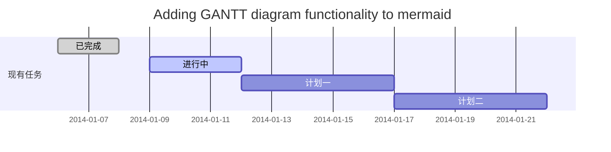
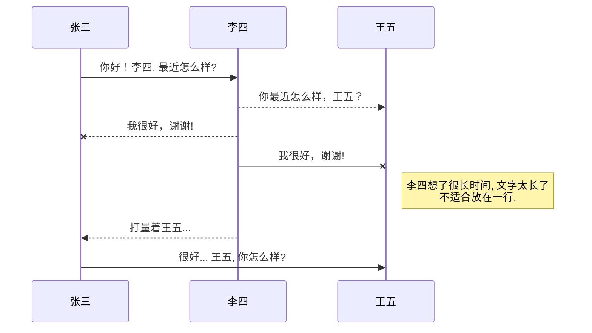
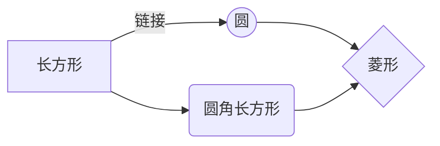

# 【狂】Java基础-notes

Created: Dec 27, 2020 1:57 AM
修改时间: Dec 27, 2020 2:33 AM
完成: Yes
打卡: https://www.notion.so/e1d71e6aa900448fb652c2e64aea530b, https://www.notion.so/java-P1-P8-d21bd533ec9446e6b23eccc416556736, https://www.notion.so/Java-p5-p8-b02802b8e5014584bfed2b3290675d30, https://www.notion.so/Java-8e8434025cea4e26b764d94d6bb83e2c
来源: 狂神说
概述: 8周任务量

P1-79/80 (第 80 需要学完 其他 第一阶段课程之后 再看)

# 前言

## P1 解决大家的疑问

[P1 前言01：解决大家的疑问](https://www.bilibili.com/video/av68373450?p=1)


### 各领域都可以用Java构建

- 网站
- 系统
- 后台
- APP（安卓）
- 云系统管理后台
- 大数据
- SaaS
- 桌面工具（少了，但是破解软件可以）


## P2 Java还是Python

[P2 前言02：Java和Python的抉择](https://www.bilibili.com/video/av68373450?p=2)

### 选择Java还是Python

**Java**

- 源自C，C++体系，1995年推出
- 给程序员设计 大型的分布式复杂应用

**Python**

- 1991推出
- 面向系统管理 科研教育的 非程序员群体
- 上手快

**如何选择**

- 语言不是关键，主要是看你解决什么样的问题
- 封装、接口之类的的理解都是很重要的，还是最好能学会（Java要求你懂）
- 学会Java 其他的都较为容易了

### 程序语言排行榜: TIOBE


[index | TIOBE - The Software Quality Company](https://www.tiobe.com/tiobe-index/)

## P3 学习方法+课程概述

[P3 前言03：学习方法及课程概述](https://www.bilibili.com/video/av68373450?p=3)

### 什么是Java

- 最早是C（高级语言），需要管理内存，指针
- Java摒弃了C麻烦的地方

### Java能干什么

- Java可以写手机应用，安卓程序开发
- 我的世界（桌面游戏）（C++现在更合适，Java的少了）
- 大数据分析平台（比如实时更新交通效率-红绿灯，警报平台），几乎所有大数据领域都用Java（Hadoop就是Java写的）

### Java 学习路径

- Java基础，图形界面，网络编程（爬虫）
- 数据库：JDBC（Java如何操作MySQL，UML架构的思想-抽象）
- 前端知识：html, css, js, (写出页面，有交互效应)
- JavaWeb：学习服务器，协议，如何传输数据，交互，如何构建（动起来，有功能）
- 前四个：就可以建立出来网站了，code可能有点繁琐，所以要进入下面的学习
- SSM框架：简化操作数据库，简化JavaWeb
- Linux: 大型互联网公司的服务器
- Linux之前 就可以去工作了
- SpringBoot：微服务（大的网站拆成多个点一起开发），新技术
- SpringCloud: 微服务，新的技术，解决方案
- Hadoop:大数据入门

这个整体学习体系可以再回看，在视频里，每一个sub section都有子模块


### 学习Tips

- 多写代码，多写笔记，多写文章
- 多交流（加群之类的），多练（思维，oop思想），技能（技术，要有嗅觉）
- 多分享知识，多看bug是怎么回事，多思考为什么
- 坚持

## P4 关于教育机构的想法

[P4 前言04：关于教育和对大家的期望](https://www.bilibili.com/video/av68373450?p=4)

---

# 预科

## P5 博客的重要性

[P5 预科01：博客的重要性](https://www.bilibili.com/video/av68373450?p=5)

### 注册博客：

- 博客园
- CSDN
- 简书
- 知乎

注意：可以购买自己的个人网站

### 我自己的博客

- CSDN：微信注册，直接CSDN手机APP扫码登录就好（紫苵枫）
- 博客园：qq号邮箱+美国手机 注册

### 其他构建网站的平台：

- 可以自己写：比如

    [首页-KuangStudy](http://www.kuangstudy.com/index)

- workpress
- typecho(小巧，巨快，反应速度快，主题可以自写)

## P6 Markdown语法

[P6 预科02：Markdown语法详解](https://www.bilibili.com/video/av68373450?p=6)

### Typora中Markdown语法

- 推荐的文本编辑器：Typora
- 右键就可以拆入很多东西了
- 图片的话，就自动切入了
- 可以直接复制到博客

```markdown
# Title

**粗体**

*斜体*

***斜体+加粗***

~~划掉~~

> Quote

分割线:

---

***

图片

本地图片：


# CSDN中加上#pic_center 就是图片居中


[超链接](https://www.tiobe.com/tiobe-index/)

列表

1. a
2. slk

- sakd
- dsa

表格

右键表格

| 名字   | 性别 | 生日 |
| ------ | ---- | ---- |
| dalskd | asda | asd  |

```java
#java script
```
```

### CSDN中的一些高级Markdown书写格式

直接去网站看效果！

```markdown
### SmartyPants
SmartyPants将ASCII标点字符转换为“智能”印刷标点HTML实体。例如：
|    TYPE   |ASCII                          |HTML
|----------------|-------------------------------|-----------------------------|
|Single backticks|`'Isn't this fun?'`            |'Isn't this fun?'            |
|Quotes          |`"Isn't this fun?"`            |"Isn't this fun?"            |
|Dashes          |`-- is en-dash, --- is em-dash`|-- is en-dash, --- is em-dash|

## 创建一个自定义列表
Markdown
:  Text-to-HTML conversion tool

Authors
:  John
:  Luke

## 如何创建一个注脚

一个具有注脚的文本。[^2]

[^2]: 注脚的解释

##  注释也是必不可少的

Markdown将文本转换为 HTML。

*[HTML]:   超文本标记语言

## KaTeX数学公式

您可以使用渲染LaTeX数学表达式 [KaTeX](https://khan.github.io/KaTeX/):

Gamma公式展示 $\Gamma(n) = (n-1)!\quad\forall
n\in\mathbb N$ 是通过欧拉积分

$$
\Gamma(z) = \int_0^\infty t^{z-1}e^{-t}dt\,.
$$

> 你可以找到更多关于的信息 **LaTeX** 数学表达式[here][1].

## 新的甘特图功能，丰富你的文章


- 关于 **甘特图** 语法，参考 [这儿][2],

## UML 图表

可以使用UML图表进行渲染。 [Mermaid](https://mermaidjs.github.io/). 例如下面产生的一个序列图：



这将产生一个流程图。:



- 关于 **Mermaid** 语法，参考 [这儿][3],

## FLowchart流程图

我们依旧会支持flowchart的流程图：
```mermaid
flowchat
st=>start: 开始
e=>end: 结束
op=>operation: 我的操作
cond=>condition: 确认？

st->op->cond
cond(yes)->e
cond(no)->op
```

- 关于 **Flowchart流程图** 语法，参考 [这儿][4].

## 导出与导入

###  导出
如果你想尝试使用此编辑器, 你可以在此篇文章任意编辑。当你完成了一篇文章的写作, 在上方工具栏找到 **文章导出** ，生成一个.md文件或者.html文件进行本地保存。

### 导入
如果你想加载一篇你写过的.md文件，在上方工具栏可以选择导入功能进行对应扩展名的文件导入，
继续你的创作。

 [1]: http://meta.math.stackexchange.com/questions/5020/mathjax-basic-tutorial-and-quick-reference
 [2]: https://mermaidjs.github.io/
 [3]: https://mermaidjs.github.io/
 [4]: http://adrai.github.io/flowchart.js/
```

## P7 什么是计算机

[P7 预科03：什么是计算机](https://www.bilibili.com/video/av68373450?p=7)

- 组成：硬件+软件（软件：比如操作系统）
- 分为：台式计算机，笔记本，大型计算机（军事）
- 能做什么：科学计算（航空），数据处理（大数据），自动控制（导弹，自动驾驶），计算机辅助设计（设计图纸），人工智能，网络（计算机作为互联网中的节点）
- 现有研究：计算机-人脑研究

## P8 硬件, 冯诺依曼结构

[P8 预科04：硬件及冯诺依曼结构](https://www.bilibili.com/video/av68373450?p=8)

### 硬件概念

- 计算机硬件：一些`物理装置`按系统结构的要求构成有机整体 为`软件运行`提供物质基础
- 硬件组成：
    - CPU
    - 主板
    - 内存
    - 电源，主机箱
    - 硬件
    - 显卡，键盘，鼠标，显示器
    - ...

### 硬件组成（下面前三个就能跑起来了）

- CPU：最重要，执行所有计算（造假最贵）
- Memory 内存：程序读取的数据、得到的结果都放在内存
- Methoerboard 主板：程序运行的时候，CPU读取内存（所以需要主板帮助数据传输），下面的那些线路就是数据传输的线路，主板插上电源就能跑了
- IO：input ouput 设备


### 冯诺依曼体系结构

- 冯诺依曼：数学家，计算机之父：图灵，冯诺依曼
- CPU：
    - 运算器
    - 控制器（可以控制输入输出设备）
- 例子：
    - CPU控制 输入设备 输入: 1+1
    - CPU调用内存的数据 用 运算器运算，将结果放回内存
    - CPU控制输出设备输出结果2


## P9 软件

[P9 预科05：软件及软件开发](https://www.bilibili.com/video/av68373450?p=9)

- 软件：让计算机按照预先预定好的顺序 完成特定功能
- 按功能分类：
    - 系统软件：早期的磁盘操作系统（Disk Operating System）, Windows, Linux（服务器端用的多）, Unix, Mac, Android, iOS
    - 应用软件：WPS, QQ, 微信， 游戏
- 开发：制作软件的过程
- 软件开发：借助开发工具和计算机语言制作软件
- 人机交互：图形化界面（windows等，窗口操作），命令行

## P10 Windows快捷键

[P10 预科06：Windows常用快捷键](https://www.bilibili.com/video/av68373450?p=10)

- 关掉窗口：`Fn` 开启时，`Alt` + `F4`
- 永久删除：`shift` + `delete`
- 打开程序（run）：`Windows` + `R` （比如之后输入`cmd`）
- 打开我的电脑/文件管理器：`Windows` + `E`
- 任务管理器
    - 直接下面的bar中右键-任务管理器
    - `Control` + `Shift` + `Esc`
    - 比如，如果结束`Windows资源管理器`，桌面就没了，这个时候，如果要恢复，可以点击`文件`，新建任务，输入`Explorer`就回来了
- 窗口排列：`Windows` + `Tab`

## P11 Dos命令

[P11 预科07：基本的Dos命令](https://www.bilibili.com/video/av68373450?p=11)

- Windows中的指令: DOS
- 如何打开（cmd）DOS命令台：
    - 菜单-Windows系统-命令提示符（这个切 管理员运行）
    - `Windows` + `R` , 之后输入`cmd`
    - 任意文件夹: 点住 `Shift` + 鼠标右键，选择`在此处打开power shell窗口`
    - 随便进入文件夹，在地址栏前面输入`cmd` + `空格`

```powershell
# 盘符切换
E:
C:

# 查看目录下所有文件
dir

# change directory 如果换盘 cd，需要参数/d, 路径的斜杠是\
cd /d E:\folder

# clear screen 清理屏幕
cls

# 推出终端
exit

# 查看电脑ip, 配置
ipconfig

# 可以直接通过cmd打开程序，比如：
calc
mspaint
notepad

# ping 命令， 可以显示ip地址（测试网络）
ping www.baidu.com

# 创建folder
md folder

# 新建一个file
cd>file.txt

# 删除一个file
del file.txt

# 移除一个目录/folder, remove directory
rd folder
```

在cmd中，鼠标右键就是粘贴！

## P12 计算机语言发展史

[P12 预科08：计算机语言发展史](https://www.bilibili.com/video/av68373450?p=12)

- 更容易，更强
- 发展-3个时代：
    - 机器语言（只有二进制）
    - 汇编语言
    - 高级语言

机器语言

- 第一代语言
- 基于二进制计算
- 不用进行转换，计算机直接可以识别、执行

汇编语言

- 第二代语言
- 用单词代替二进制数据
- 目前应用： 逆向工程（破解，你想开发，加密解密），机器人，计算机病毒

高级语言

- 第三代语言
- 汇编无法解决
- 可以分为
    - 面向过程（C语言）
    - 面向对象（C++，Java）
- 比如：
    - C语言（高级语言鼻祖，既有高级语言特点，也有汇编语言特点，写系统，可以不依赖计算机硬件）
    - C++（C语言的面向对象的版本）
    - JAVA（开始叫做C++ - -）
    - C#（C sharp，微软想要自己的语言，虽然自己很喜欢Java，但是微软不通用）
    - Python
    - PHP（快速构建网站）...

摩尔定律：现在放慢了（未来是 量子计算机？）


# 第二阶段：Java简介&IDE

## Java诞生

[P13 Java入门01：Java帝国的诞生](https://www.bilibili.com/video/av68373450?p=13)

### Java之前的C语言

- C语言1972诞生
    - 贴近硬件（汇编），运行快，效率高
    - 写了 操作系统，编译器，数据库，网络系统
    - 枷锁：指针，内存管理（只有运行的时候才会发现）（麻烦，小错误可能就失败了）
- C++1982诞生
    - 提出了面向对象
    - 更复杂
    - 在图形领域和游戏 比较成功
    - 偏底层，要操作指针，内存

### 新语言的萌生

所以想建立新语言

- 语法像C
- 不要指针，内存管理
- 写一次就可以到处运行
- 面向对象
- 类型安全
- 高质量 类库

→Java

- Java虚拟机 JVM，安装了JVM环境，装上就可以跑了

### Java介绍

- Java 1995 诞生
- 当时网页粗糙，缺乏互动性，于是Java开发了图形界面的程序Applet，广泛推广
- 1998年，推出了三个方向
    - Java SE 开发桌面（但是丑，还需要弄虚拟机）
    - Java ME （手机，移动互联网还不太行）
    - Java EE （服务器端，赶上互联网发展，强大， 简单，快平台，适合开复杂的大项目）

### 三高

- 高可用
- 高性能
- 高并发

### 其他Java知识

- 下面大部分都是开源的


- Eclipse由Java开发（IBM开发）
- 2006 Java 写了Hadoop，这样写MapReduce就可以了，占领了大数据
- Android上 运行的也是Java 软件，开始占领手机端

### 主要竞争对手：微软

- 看着服务器端市场被Javsa占有，于是开发了.NET
- 开发工具Visual Studio
- 应用服务器 IIS
- 数据库SQL server
- 微软的这些只能运行在windows平台中

## Java特性，优势

[P14 Java入门02：Java特性和优势](https://www.bilibili.com/video/av68373450?p=14)

- 简单，不用分配内存，语法基于C
- 面向对象的 程序设计
- 跨平台性（windows， mac，windows），一次编写就行了
- 高性能 效率高
- 可以写分布式，可以说处理网上资源，支持远程方法调用
- 动态性（反射机制）
- 支持多线程
- 安全（适合网络，防病毒防篡改）
- 提前对内存进行检查，有异常机制
- 使用人多

## Java 3大版本

[P15 Java入门03：Java三大版本](https://www.bilibili.com/video/av68373450?p=15)

偏向web设计，Java应用程序可以run在任何平台（因为有JVM虚拟机）

### JavaSE

- 标准版，基础&核心
- 主要用于开发桌面程序，控制台开发

### JavaME

- 微缩版，嵌入式开发
- 用的人少，可以不学

### JavaEE

- 企业版
- 网站，企业应用系统
- 偏服务器端开发
- 学习基础就是JavaSE

## JDK JRE JVM

[P16 Java入门04：JDK JRE JVM](https://www.bilibili.com/video/av68373450?p=16)

### JDK

- 开发者工具
- 包含JRE和其他所有东西，还有自己的开发工具
- 要学开发的化，就要安装JDK（因为包含可JRE，就不用重复安装JRE了）

### **JRE**

- 运行时环境
- 包含JVM，还有Applet
- 一些Library
- 安装了JRE就可以运行Java程序了

### JVM

- 就像模拟了一个CPU来处理Java相关的东西
- 之后会学java 代码如何编译成字节码 （解释，编译）


## 安装开发环境

[P17 Java入门05：安装开发环境](https://www.bilibili.com/video/av68373450?p=17)

- 需要下载JDK
- 配置环境变量
- JDK目录
- hello world
- Notepad++使用

企业中最常见的是JDK8

### 如何卸载JDK

- 找到安装目录，进入environment variables (system variables)的JAVA_HOME
- 进入安装地址，直接将文件夹删除
- 删掉JAVA_HOME这个环境变量，还有Path中的JAVA_HOME这个变量
- CMD检查：

```python
Java -version
```

### 安装

- 搜索oracle java SE JDK8
- 同意协议，下载电脑对应的版本
- 最新的东西可能不稳定，企业不常用
- 双击安装
- 记住安装路径
- 添加environment variable: 在系统变量中新建
    - 名字是：JAVA_HOME
    - 值：安装路径

    `C:\MyProgram\Environment\Java\jdk1.8`

- 配置path变量
    - 系统环境变量中点击Path
    - 添加 `%JAVA_HOME%\bin` （确实存在bin）
    - 添加 `%JAVA_HOME%\jre\bin` （确实存在`jre\bin`,对应真实目录）

    %JAVA_HOME% 中 %% 表示引用路径，也就是cd到JAVA_HOME之后，再用相对路径

- 检查安装是否成功 `Java -version`

### 目录介绍

- bin 放可执行程序
    - java.exe （这两个可以运行java文件）
    - javac.exe
- include
    - jdk是用C，C++编写的，需要引用一些头文件（？）
    - 启动的时候，需要引用这些头文件
- ire
    - 运行环境（如果只跑java的话，用这个就够了）
- lib
    - 类库文件
- src.zip
    - 资源文件，放了类
    - 解压打开
    - com中sun就是sun定义的 java 核心源代码
    - 各种类
    - 基础类源代码

## helloworld

[P18 Java入门06：HelloWorld详解](https://www.bilibili.com/video/av68373450?p=18)

- 随便一个位置新建folder 放代码
- 新建java文件
    - 后缀`.java`
- 新建hello world（文件名和class名必须一致！）

```java
# hello.java
public class hello{ #表示一个类 public是修饰符
	public static void main(String[] args){ #前面是修饰符，main是方法/主方法，（）中是参数
		System.out.print("Hello, World!");
	}
}
```

运行

- 将java 编译成字节码文件
    - 运行之后自动生成了hello.class

```bash
javac hello.java
```

- 运行这个class文件（不需要后缀了，写后缀会报错）

```bash
java hello
```

## 编译型 解释型

[P19 Java入门07：编译型和解释型](https://www.bilibili.com/video/av68373450?p=19)

Java既有编译 也有解释型的特点

### 概念解释

例子：

- 如果要把中文书翻译成英语，有两种方法
    - 把整本书翻译好
        - 如果更新的话，还要重新翻译
    - 找翻译官，想看那段随时翻译
        - 如果改动的话， 可以随时翻译

编译型

- 例子中的 整本书翻译
- 负责翻译的程序，将java源代码，翻译成计算机能读的代码-compile
- 这个程序叫做编译器

解释型

- 类似翻译
- 说一句，解释一句
- 需要什么，读什么
- 回头再看又要重新翻译

### 利弊

编译型

- 已经全部翻译好了，执行速度更快， 电脑直接执行就行了
- 操作系统开发，一般用编译型，比如C，C++

解释型

- 比如网页，服务器脚本，对速度要求不高

### java的 编译&解释


- .java 文件变成.class文件： 通过java编译器，编译，class文件被真正执行
- class就是字节码文件
- 将class 文件放到虚拟机JVM的类装载器里
- 字节码校验器-看看写的代码对不对
- 然后用解释器 解释到操作系统中
- 随着技术发展，这个解释和编译的过程 界限变得模糊，解释的效率也大大提升（硬件up）
- java 是先编译，到操作系统的时候才会解释

## IDEA安装

[P20 Java入门08：使用IDEA开发](https://www.bilibili.com/video/av68373450?p=20)

### IDE

- 如Eclipse， IDEA
- IDE： integrated development environment集成开发环境
- 一般包括 代码编辑器，编译器，i澳视其，图形界面
- 官网

[JetBrains: Developer Tools for Professionals and Teams](https://www.jetbrains.com/)

[Download IntelliJ IDEA: The Java IDE for Professional Developers by JetBrains](https://www.jetbrains.com/idea/download/#section=windows)

### IDEA

- 打开一个项目
- 一般在src下写代码
- 新建一个class就行
    - psvm
    - sout

- idea优化

# 第三阶段：Java基础语法

# Java基础语法

### 内容

- 注释，标识符，关键字
- 数据类型
- 类型转换
- 变量，常量
- 运算符
- 包机制
- JavaDoc

### 准备启动 IDE

- 建立一个empty project
- 然后插入一个 java module
- 命名JavaSE, 在project structure设置java环境


## 注释

`Demo01`

[P21 Java基础01：注释](https://www.bilibili.com/video/av68373450?p=21)

可以设置注释的颜色字体等


### 三种Java注释

- 单行

```java
// 单行注释
```

- 多行

```java
/*
多行注释

*/
```

- JavaDoc: 文档注释

```java
/**
 * @Description HelloWorld
 * @Author Kaitan
 * 
 *
 *
 */
```

## 标识符

[P22 Java基础02：标识符和关键字](https://www.bilibili.com/video/av68373450?p=22)

`Demo02`

### 关键字

- 造物主/开发者 定义的 已经有功能/意义的 单词
- 不能用他们起名


### 标识符

- 类名，变量名，方法名，都是标识符

    

- 注意 字母，$, _ 开始，后面可以加数字

## 数据类型

[P23 Java基础03：数据类型讲解](https://www.bilibili.com/video/av68373450?p=23)

## 强弱类型 语言

- Java是强类型语言
- 强类型：
    - 必须严格定义变量
    - 必须先定义再使用！
    - 在没有转换类型时，类型不变
    - 好处：安全性高
    - 弊端：速度慢
    - C++，JAVA
- 弱类型语言：
    - 比如JavaScript，VBscript
    - 定义时，可以不符合规定


## 基本类型

- 整合
    - int一般够用，±21亿
- 浮点（小数）
    - double一般够用
- 字符
- bollean


### 引用类型

- 基本类型之外都叫reference type


### 字节

- 计算机是二进制，位是最小单位，比如11001100中 就是8个位（bit）
- 字节：
    - 处理数据的基本单位
    - B表示
    - 1B（字节，byte）=8bit（位）
    - 8个字节，就是64 位
- 32位，64位 电脑区别
    - 电脑32位 操作系统 只可以用 32位的CPU
    - 电脑64位 操作系统 可以用 32位的CPU ，也可用64位的CPU
    - （内存中）寻址能力 跟他们挂钩
        - 64位最多可以支持128G内存
        - 32位最多可以支持4G内存
- 字符：
    - 字母， 数字，字，符号
    - char
- 单位转换


## 数据类型

[P24 Java基础04：数据类型扩展及面试题讲解](https://www.bilibili.com/video/av68373450?p=24)

`Demo03`

### 调试

- 打一个红点
- 点击 类似 蟑螂的 按钮
- 运行到红点行之前
- IDE会自动输出当前环境变量


## 类型转换

[P25 Java基础05：类型转换](https://www.bilibili.com/video/av68373450?p=25)

`Demo04` `Demo05`

- 高低 是 容量（小数 高于 整数）/内存
- 高转低：强制转换 (type)var
- 低转高：自动转换（不需要写）
- 注意精度问题，内存溢出


## 变量

[P26 Java基础06：变量、常量、作用域](https://www.bilibili.com/video/av68373450?p=26)

### 变量声明要求

`demo06`

- 变量其实是 占据了一部分空间，空间定死了，但是内容可以改变，类似“衣柜”
- 声明变量：定义变量 类型，变量名，作用域
- 如下，可以一行写多个变量，但是不建议
- 分号结束


### 变量的3种作用域

`Demo07`

1. 类变量
    - 加static
    - 从属于类 （类似实例变量）
    - 直接可以用
    - （新手，先都加static）
2. 实例变量
    - 方法外面，类里面
    - 作用域比局部变量更大
    - 从属于对象
    - 不需要 声明 初始化值
        - 虽然没有声明，但是仍然可以输出，输出的是其 default value
    - 使用时较为麻烦 如 demo07.age
3. 局部变量
    - 在方法里，只作用在方法里 （不加static 时 仅在方法内有效）
    - 使用时必须声明初始化值

### 类型无initial value时（实例变量）默认值

- 基本类型以外的所有（如String）：null
- 数值类型： 0 or 0.0
- char16位0：0
- 布尔值：false

### 常量

- 初始化后，不能变动了
- 一般全部大写

```java
public class Demo07 {
    //类里面还可以有属性 （变量）

    //实例变量,从属于对象
    String name;
    int age;

    //类变量：从属于类
    static double salary=2500;
    static final double PI =3.14; //常量 final
    final static double PI1 =3.14; //修饰符static 放前放后 都可以

    //main 方法
    public static void main(String[] args) {
        //局部变量
        int i=10;

        //实例变量的使用 演示
        //变量类型 变量名 = new Demo07();
        Demo07 demo07 = new Demo07();
        System.out.println(demo07.age); //0
        System.out.println(demo07.name); //null
        //此时如果run main（）， 虽然没有声明，但是仍然可以输出，输出的是其 default value

        //类变量 演示
        System.out.println(salary);
    }

    //类里面 还可以有其他方法
    public void add(){

    }
}
```

### 变量命名规范

- 要求见名知意
- 除了类名 首字母大写，常量全大写+下划线，其他都是首字母小写其他驼峰


## 基本运算符

[P27 Java基础07：基本运算符](https://www.bilibili.com/video/av68373450?p=27)

[P28 Java基础08：自增自减运算符、初识Math类](https://www.bilibili.com/video/av68373450?p=28)

[P29 Java基础09：逻辑运算符、位运算符](https://www.bilibili.com/video/av68373450?p=29)

[P30 Java基础10：三元运算符及小结](https://www.bilibili.com/video/av68373450?p=30)

### 运算符list


### 难点

- % 取余数/模运算
- **instanceof** 之后 面向对象再说
- 与或非 &&  ||      !

    ```java
    //and or not
            boolean a= true;
            boolean b=false;
            System.out.println("a && b:"+(a&&b));
            System.out.println("a || b:"+(a||b));
            System.out.println("!b:"+(!b));

            //短路，看&&前面一项false时会不会执行后面一项，其实不会执行
            int c=5;
            boolean d= (c<4)&&(c++<4);
            System.out.println(d);
            System.out.println(c);
    ```

- 位运算符

    ```java
    /*
            A=0011 1100
            B=0000 1101

            A&B 0000 1100 //每位  取 与
            A|B 0011 1101 //每位 取 或
            A^B 0011 0001 //相同 0， 不相同 1
            ~B 1111 0010 //取反

            2*8最快是什么 （2*2*2*2）
            //向左移1位<< 二进制，即 *2
            //向右移1位>> 二进制，即 /2
            0000 0000： 0
            0000 0001： 1
            0000 0010： 2
            0000 0011： 3
            */
            System.out.println(2<<3);
    ```

- ++ --

    难点！！ ++a表示先进性a=a+1,然后再对a进行相关运算， a++指先做前面的运算，然后再a=a+1

    ```java
      int a = 3;
      int b = a++; //相当于 b=a, a=a+1, b=3
      System.out.println(a); //4
      int c = ++a; //相当于a = a+1, c=a, c=5

      System.out.println(a);//5
      System.out.println(a++); //5 print(a), a=a+1
      System.out.println(a); //6
      System.out.println(--a); //5 a=a-1, print(a)
      System.out.println(a); //5
      System.out.println(b); //3
      System.out.println(c); //5
    ```

- 幂运算

    ```java
    //幂运算，java里面没有2^3
    double pow=Math.pow(2,3);
    System.out.println(pow); //8.0
    ```

- +=

    ```java
    //+= -= *= /=
            int a= 10;
            int b= 20;
            a+=b;
            System.out.println(a); //a = a+b
    ```

- +

    ```java
    //字符串连接符 +
            System.out.println(a+b);
            System.out.println(""+a+b); 
    				//3020 若+ 左右任意一项 String 时，会转为String  再连接
            System.out.println(a+b+"");//50
    ```

- ? :

    ```java
    //? :
            //x ? y : z
            //如果x == ture, 输出y 否则 z
            int score = 80;
            String result = score <60 ?"fail":"pass";
            System.out.println(result); //"pass"
    ```

- 优先级：
    - 都用（）就行
    - 一元运算>加减乘除>与或

## 包机制

从头开始吧

[P31 Java基础11：包机制](https://www.bilibili.com/video/av68373450?p=31)

- 包的本质：文件夹
- 公司域名倒置，为包名
    - 如com.kaitan.www
    - 其实是com- kaitan - www
    - kaitan， www都是文件夹，可以增设其他同级文件夹
    - 包内自动生成 `package com.kaitan.operator`


### 导入其他包

- 必须在 `package com.kaitan.operator`  下面
- `import java.util.Date;`
- `import com.kaitan.operator.*`; 导入所有的类
- alt + 回车 可以自动排错

### 包（类名）重复

- 类名重复会报错


### 看其他的包

- 点击String 看源代码，找到上面的包名
- control+鼠标右键看class内

## JavaDoc

[P32 Java基础12：JavaDoc生成文档](https://www.bilibili.com/video/av68373450?p=32)

### JavaDoc

- javadoc 帮助文档

[Java Platform SE 8](https://docs.oracle.com/javase/8/docs/api/)


- 在class 上面 写类的注释
- 在方法上面直接敲击 /** 生成 该方法的 注释模板

```java
package com.kaitan.foundamentals.basics;

/**
 * @author Kaitan
 * @version 1.0
 * @since 1.8
 */
public class Doc {
    String name;

    /**
     * @author
     * @param name
     * @return
     * @throws Exception
     */
    public String test(String name) throws Exception{
        return name
    }
}
```

### 从Idea打开explorer


### 命令行生成doc

- 进入.java地址
- `javadoc -encoding UTF-8 -charset UTF-8 Doc.java`
    - `-encoding UTF-8` 帮助处理中文
    - `-charset UTF-8` 帮助处理中文
    - 结果

        ```java
        Building tree for all the packages and classes...
        Generating .\com\kaitan\foundamentals\basics\Doc.html...
        Doc.java:12: warning: no description for @author
             * @author
               ^
        Doc.java:13: warning: no description for @param
             * @param name
               ^
        Doc.java:14: warning: no description for @return
             * @return
               ^
        Doc.java:15: warning: no description for @throws
             * @throws Exception
               ^
        Generating .\com\kaitan\foundamentals\basics\package-frame.html...
        Generating .\com\kaitan\foundamentals\basics\package-summary.html...
        Generating .\com\kaitan\foundamentals\basics\package-tree.html...
        Generating .\constant-values.html...
        Building index for all the packages and classes...
        Generating .\overview-tree.html...
        Generating .\index-all.html...
        Generating .\deprecated-list.html...
        Building index for all classes...
        Generating .\allclasses-frame.html...
        Generating .\allclasses-noframe.html...
        Generating .\index.html...
        Generating .\help-doc.html...
        4 warnings
        ```

- 生成文档，其中点击index直接就是 doc 网页了

    

### IDEA中生成JavaDoc

- tools generate javaDoc
- 可以在Setting中搜索doc 然后找到ta在那个板块


# 第四阶段: Java流程控制

# Java流程控制


## Scanner介绍

- [ ]  [P33 Java流程控制01：用户交互Scanner](https://www.bilibili.com/video/av68373450?p=33)

理解起来有点难，首先，声明了new的新Scanner 对象之后，并没有直接运行，只是继承了一个System.in 可以理解为定义了一个对象/函数，并没有调用，当单独使用 scanner.next() ， scanner.hasNext()等一系列函数时，都会要求对方现有输入（类似input），然后再输出T/F（hasNext系列），或者是user输入的内容（has系列）

如果已经声明了一个Scanner对象，那么，用户input的内容储存在这个Scanner对象中，然后可以用hasNext，或者next 对输入内容进行输出（**同一份内容**）。区别是，hasNext系列会判断Scanner对象里是否存留还没有显出来的内容（所以hasNext之后使用的next不需要重复输入，因为他先判断有存留内容，然后靠next输出了这个任容，此时，如果再使用hasNext就要求重新输入了——这可能就是hasNext的字面意思了）


，

### next()接收input

- 接收方式

    

```java
package com.kaitan.foundamentals.scanner;
import java.util.Scanner;
public class Demo01 {
    public static void main(String[] args) {
        //创建扫描器 对象, 类似python中的input（）
        Scanner scanner = new Scanner(System.in);
        System.out.println("使用next方式接收：");

        //判断对方有没有输入string
        if (scanner.hasNext()){
            //有则 通过next（）接收
            String str = scanner.next(); //程序等待输入
            System.out.println("输入内容："+str);
        }

        //凡是IO，不关就会占用资源，之后要关掉
        scanner.close();
    }
}

//结果
/* 使用next方式接收：
Hi Kaitan
输入内容：Hi
*/
```

### hasNext()和Next()

- hasNext()和Next()效果其实是一样的，系统都会等待输入下一个字符，只是返回值不同，hasNext()会返回true，next()返回输入的字符。
- hasNext()会让user输入，但nextLine不会要求用户重新输入，而是将结果输出

    ```java
    System.out.println(scanner.hasNext());
    System.out.println(scanner.nextLine());
    ```

- nextLine()会让user输入，hasNext()会要求用户重新输入

    ```java
    System.out.println(scanner.nextLine());
    System.out.println(scanner.hasNext());
    ```

- nextLine()会让user输入，hasNext()会要求用户重新输入

    ```java
    System.out.println(""+scanner.next());
    System.out.println(""+scanner.hasNext());
    //results
    请输入：
    da
    da
    da
    true
    ```

- nextLine()会让user输入，hasNext()会要求用户重新输入

    ```java
    System.out.println(""+scanner.next());
    System.out.println(""+scanner.hasNextLine());

    //results
    请输入：
    dat
    dat
    true
    ```

- nextLine()会让user输入，hasNext()会要求用户重新输入

    ```java

    //results
    请输入：
    dat
    dat
    true
    ```

- nextLine()会让user输入，hasNext()会要求用户重新输入

    ```java
    System.out.println(""+scanner.hasNext());
    System.out.println(""+scanner.next());

    //results
    请输入：
    dat
    true
    dat

    ```

- hasNext()要求对方输入，to have a next input
- nextLine() next()是单纯提取输入（但是 如果 之前没有hasNext()，自己也会trigger一次input）

```java
Live Demo
package com.tutorialspoint;

import java.util.*;
import java.util.regex.Pattern;

public class ScannerDemo {
   public static void main(String[] args) {

      String s = "Hello World! 3 + 3.0 = 6";

      // create a new scanner with the specified String Object
      Scanner scanner = new Scanner(s);

      // check if the scanner has a token
      System.out.println("" + scanner.hasNext());

      // print the rest of the string
      System.out.println("" + scanner.nextLine());

      // check if the scanner has a token after printing the line
      System.out.println("" + scanner.hasNext());

      // close the scanner
      scanner.close();
   }
}

//results:
true
Hello World! 3 + 3.0 = 6
false
```

### nextLine()接收input

- 接收方式

    

```java
package com.kaitan.foundamentals.scanner;
import java.util.Scanner;
public class Demo02 {
    public static void main(String[] args) {

        //创建扫描器 对象, 类似python中的input（）
        Scanner scanner = new Scanner(System.in);
        System.out.println("使用nextLine方式接收：");

        //判断对方是否还有输入string
        if (scanner.hasNextLine()){
            //有则 通过next（）接收
            String str = scanner.nextLine(); //程序等待输入
            System.out.println("输入内容："+str);
        }

        //凡是IO，不关就会占用资源，之后要关掉
        scanner.close();
    }
}

//结果
/* 使用nextLine方式接收：
Hi Kaitan biubiubiu
输入内容：Hi Kaitan biubiubiu
*/
```

### hasNextInt(), hasNextFloat(), nextInt(),

```python
//Demo04
Scanner scanner = new Scanner(System.in);
        int i = 0;
        float f = 0.0f;

        // integer input
        System.out.println("Please enter integer:");

        if (scanner.hasNextInt()){
            i = scanner.nextInt();
            System.out.println("Interger" + i);
        } else {
            System.out.println("Not integer, try again!");
        }

        // float input
        System.out.println("Please enter float:");
        // !!!: hasNextFloat will not require re-enter

        if (scanner.hasNextFloat()){
            f = scanner.nextFloat();
            System.out.println("Float " + f);
        } else {
            System.out.println("Not float, try again!");
        }
        scanner.close();
```

### 使用循环，让用户通过回车 来多重输入

- [ ]  [P34 Java流程控制02：Scanner进阶使用](https://www.bilibili.com/video/av68373450?p=34)

```python
//输入多个数字，求sum，average，用回车确认输入，如果输入非数字，就结束
//Demo05

        Scanner scanner = new Scanner(System.in);

        double sum = 0;
        int n = 0;

        while (scanner.hasNextDouble()){
            System.out.println("Please enter number");
            double x = scanner.nextDouble();
            n ++;
            sum +=x;
            System.out.println(n+" th data, current result is "+sum);
        }

        System.out.println(n + "sum is "+ sum);
        System.out.println(n + "average is " + (sum/n));
```

## 顺序结构

- [ ]  [P35 Java流程控制03：顺序结构](https://www.bilibili.com/video/av68373450?p=35)


Java最基础的结构-顺序结构： 一行一行往下运行

```python
package com.kaitan.foundamentals.structure;

public class Demo01 {
    public static void main(String[] args) {
        System.out.println("hello1");
        System.out.println("hello2");
        System.out.println("hello3");
        System.out.println("hello4");
        System.out.println("hello5");
    }
}
```

## 选择结构

- [ ]  [P36 Java流程控制04：if选择结构](https://www.bilibili.com/video/av68373450?p=36)


### 单选择结构 （之后`if(){}`）

```python
package com.kaitan.foundamentals.structure;

import java.util.Scanner;

public class Demo01 {
    public static void main(String[] args) {
        Scanner scanner = new Scanner(System.in);
        System.out.println("Please enter: ");
        String s = scanner.nextLine();

        //equals 判断字符串是否相同
        if (s.equals("hello")){
            System.out.println(s);
        }
        System.out.println("End");
    }
}
```

### 双选择结构 （`if(){} else{}`）

```python
package com.kaitan.foundamentals.structure;

import java.util.Scanner;

public class Demo02 {
    public static void main(String[] args) {

        // score > 60, pass, else, fail
        Scanner scanner = new Scanner(System.in);

        System.out.println("Please enter score:");
        int score = scanner.nextInt();
        if (score >=60){
            System.out.println("Pass");
        }else{
            System.out.println("Fail");
        }
    }
}
```

### 多选择结构（`if(){} else if(){} else{}`）

```python
package com.kaitan.foundamentals.structure;

import java.util.Scanner;

public class Demo03 {
    public static void main(String[] args) {
        // score > 60, pass, else, fail
        Scanner scanner = new Scanner(System.in);

        System.out.println("Please enter score:");
        int score = scanner.nextInt();
        if (score == 100){
            System.out.println("S");
        }else if (score < 100 && score >=90){
            System.out.println("A");
        }else if (score<90 && score>=60){
            System.out.println("B");
        }else if(score<60 && score>=0) {
            System.out.println("Fail");
        }else {
            System.out.println("Wrong enter");
        }
    }
}
```

### If嵌套结构

可以if里面套用if

### Switch

- [ ]  [P37 Java流程控制05：Switch选择结构](https://www.bilibili.com/video/av68373450?p=37)


记得加break!

```python
public class Demo04 {
    public static void main(String[] args) {
        char grade = 'A';

        switch (grade){
            case 'A':
                System.out.println("Excellent");
                break; //如果不写这个break，入宫grade =A（符合当前这个case条件），
                        // 仍会输出后面选项的内容，这个成为 case 穿透
            case 'B':
                System.out.println("Good");
                break;
            case 'F':
                System.out.println("Bad");
                break;
            default: // 类似else
                System.out.println("Unknown level");

        }

    }
}
```

## 反编译

- 字符的本质是数字~
- 反编译： java文件 编译之后变成 字节码文件class，机子来执行，人看不懂，所以要反编译成人能看懂的（IDEA）
- 使用IDEA查看IDEA生成的 java文件路径：如下，点击project structure 查看黄色地址

    

- 如果想要反编译，就单机 package 的选项open in explorer,然后从explorer 把 java文件复制到 package中
- 此时打开这个java文件，即可看到反编译的文件如下，注意，每个对象都有个哈希code（文字也如此）

    

## 循环结构

- while
- do while
- for

### While

- [ ]  [P38 Java流程控制06：While循环详解](https://www.bilibili.com/video/av68373450?p=38)

`while(condition){}` Example

```java
package com.kaitan.foundamentals.structure;

public class Demo06 {
    public static void main(String[] args) {
        //sum of 1-100
        int sum = 0;
        int i=0;
        while(i<=100){
            sum+=i;
            i++;
        }
        System.out.println(sum);
    }
}
```

### Do While 循环

- [ ]  [P39 Java流程控制07：DoWhile循环](https://www.bilibili.com/video/av68373450?p=39)

跟while不同，把循环判断条件放在最后，至少会循环一次！while 是 先 循环判断，然后执行，可能一次也不会执行

`do{}while(condition)` Example

```java
package com.kaitan.foundamentals.structure;

public class Demo07 {
    public static void main(String[] args) {
        int sum = 0;
        int i=0;

        do {
            sum+=i;
            i++;
        }while (i<=100);

        System.out.println(sum);
    }
}
```

while，do while区别

```java
package com.kaitan.foundamentals.structure;

public class Demo08 {
    public static void main(String[] args) {
        int a = 0;
        while (a<0){
            System.out.println(a);
            a++;
        }
        System.out.println("=====================");

        do {
            System.out.println(a);
            a++;
        } while (a<0);
    }
}
```

## For 循环

- [ ]  [P40 Java流程控制08：For循环详解](https://www.bilibili.com/video/av68373450?p=40)

`for(initial ; bool; update){}`


- Example (while, for对比)

```java
package com.kaitan.foundamentals.structure;

public class Demo09 {
    public static void main(String[] args) {
        int a = 1;//initial setting

        while(a<=100){
            System.out.println(a);
            a += 2;
        }
        System.out.println("End for while loop!");

        //initial, condition, update
        for (int i = 1; i<=100; i += 2){
            System.out.println(i);
        }
        System.out.println("End for for loop");

    }
}
```

- 1-100 odd sum, even sum

```java
package com.kaitan.foundamentals.structure;

public class Demo10 {
    public static void main(String[] args) {
        // odd and even sum from 1-100
        int oddSum = 0;
        int evenSum = 0;

        for (int i = 0; i <= 100; i++) {
            if (i % 2 != 0) {//odd
                oddSum += i;
            } else {
                evenSum += i;
            }
        }
        System.out.println("OddSum " + oddSum);
        System.out.println("EvenSum " + evenSum);
    }
}
```

- 1-1000, if can be divided by 5 printed, print 3 num per line

    注意区分`System.out.println()` 和  `System.out.print("\n")`

    - `System.out.println()` 默认后面有一个`/n` 即new line
    - `System.out.print()` 没有默认的 `/n` （new line），可以输出在同一行
    - `System.out.println()` 等价于 `System.out.print("\n")`
    - `System.out.print(i+"\t")` 循环输出 其实append在了同一行

```java
package com.kaitan.foundamentals.structure;

public class Demo11 {
    public static void main(String[] args) {
        //use wihle or for to output 1-1000
        for (int i = 0; i <=1000; i++){
            if (i%5==0){
                System.out.print(i+"\t"); //print: no /n in default
            }
            if (i%(5*3)==0){
                //System.out.print("\n");
                System.out.println(); //println: has /n in default (newline)
            }
        }
    }
}
```

- 九九乘法表

开心~自己做出来了（先想思路，然后再动手），下面重点参考 行列的问概况

```java
package com.kaitan.foundamentals.structure;

public class Demo12 {
    public static void main(String[] args) {

        for (int line = 1; line<=9; line ++){
            for (int col=1; col<=line; col ++){
                System.out.print( col+"*"+line+"="+(line*col)+"\t");
            }
            System.out.println();
        }
    }
}
```

```java
1*1=1	
1*2=2	2*2=4	
1*3=3	2*3=6 	3*3=9	
1*4=4	2*4=8	  3*4=12 	4*4=16	
1*5=5	2*5=10	3*5=15	4*5=20	5*5=25	
1*6=6	2*6=12	3*6=18	4*6=24	5*6=30	6*6=36	
1*7=7	2*7=14	3*7=21	4*7=28	5*7=35	6*7=42	7*7=49	
1*8=8	2*8=16	3*8=24	4*8=32	5*8=40	6*8=48	7*8=56	8*8=64	
1*9=9	2*9=18	3*9=27	4*9=36	5*9=45	6*9=54	7*9=63	8*9=72	9*9=81
```

- [ ]  [P41 Java流程控制09：打印九九乘法表](https://www.bilibili.com/video/av68373450?p=41)

### 增强for loop

- [ ]  [P42 Java流程控制10：增强for循环](https://www.bilibili.com/video/av68373450?p=42)


- 例子
    - 声明变量要和 数组 内 format匹配
    - 例子：`for (int x:数组){}`

这个特别像python里的`for i in iter:` ，直接循环 set 或者 array内的 量。下面例子里面展示了内在逻辑。

```java
package com.kaitan.foundamentals.structure;

public class Demo13 {
    public static void main(String[] args) {
        int[] numbers = {10,20,30,40,50}; // 定义数组
        for (int x:numbers){
            System.out.println(x);
        }

        // compare with for
        System.out.println("================");
        for (int i = 0; i<5;i++){
            System.out.println(numbers[i]);
        }
    }
}
```

### break, continue, goto

- [ ]  [P43 Java流程控制11：break、continue、goto](https://www.bilibili.com/video/av68373450?p=43)


- break: 跳出整个 循环语句，不执行剩余循环节

    ```java
    package com.kaitan.foundamentals.structure;

    public class Demo14 {
        public static void main(String[] args) {
            int i =0;
            while(i<100){
                i++;
                System.out.println(i);
                if (i==30){
                    break;
                }
            }
        }
    }
    ```

- continue: 强制退出当前循环节，但是继续执行剩余 循环节

    ```java
    package com.kaitan.foundamentals.structure;

    public class Demo15 {
        public static void main(String[] args) {
            int i =0;
            while(i<100){
                i++;
                if (i%10==0){
                    System.out.println();
                    continue;
                }
                System.out.println(i);
            }
        }
    }
    ```

- goto：现在退役了，但是可以 通过在break continue上 加标签 使 跳出循环的程序 从 label处 继续开始执行，一般用于 桥套式的 复杂循环
    - 如下，定义了一个 outer标签，然后continue + outer，就将continue作用到了 outer所在的这个loop

    ```java
    package com.kaitan.foundamentals.structure;

    public class Demo16 {
        public static void main(String[] args) {
            //101-150 质数
            int count = 0;
            outer: for (int i = 101; i<=150; i++){
                for (int j =2; j<i/2; j++){
                    if (i%j==0){
                        continue outer;
                    }
                }
                System.out.println(i);
            }
        }
    }

    ```

### 练习题: 三角形

- [ ]  [P44 Java流程控制12：打印三角形及Debug](https://www.bilibili.com/video/av68373450?p=44)

```java
package com.kaitan.foundamentals.structure;

public class Demo17 {
    public static void main(String[] args) {
        int nrow = 5;
        for (int line=1; line<=nrow; line++ ){
            for (int col =1; col<=nrow-line;col++){
                System.out.print(" ");
            }
            for (int c =1; c<=2*line-1;c++){
                System.out.print("*");
            }
            System.out.println();
        }
    }
}

    *
   ***
  *****
 *******
*********
```

### Debug

1. 打一个红色符号
2. 点小蟑螂
3. 点击现面的蓝色的键，就可以一次一次跑了（能看到各变量当前的value）
4. 通过console还能看到当前的output!!! (console)


# 第五阶段: Java方法

# Java方法


## 什么是方法

- [ ]  [P45 Java方法01：什么是方法？](https://www.bilibili.com/video/av68373450?p=45)
- `System.out.println()` 中，System是class，out是object，println()是方法
- 方法：驼峰命名规则
- 一般一个方法只执行一个功能（原子性 **atomic**）
- main方法时刻保持简单干净


### 方法示例：

- 在main（）方法外定义自己的方法
- 注意看下面的批注（加static变类方法 使main可调用）

```java
package com.kaitan.foundamentals.method;

public class Demo01 {
    // main method: let program run, not defined by us
    // void修饰符，是返回值类型，表示不返回，为空
    public static void main(String[] args) {
        int sum = add(1, 2);
        System.out.println(sum);
    }

    //self defined
    //add method
    //如果不加static ,main funciton不能调用，要加static成为类变量
    // int修饰符是 返回值类型
    public static int add(int a, int b){
        return a+b;
    }

}

```

## 方法定义

- [ ]  [P46 Java方法02：方法的定义和调用](https://www.bilibili.com/video/av68373450?p=46)
- 格式如下，返回值类型在修饰符之后，中间的代码称为 方法体
- 参数类别
    - 形式参数：定义方法时 用到 的 变量名称
    - 实参：实际传输给的 参数，具体value


### 示例

- 注意: 一般return 都写在最后面
- 如果中间出现return，return会终止这个方法
- main方法是被Java虚拟机调用的，除此之外 没什么不同

```java
package com.kaitan.foundamentals.method;

public class Demo02 {
    public static void main(String[] args) {
        int max = max(10,20);
        System.out.println(max);
    }

    //compare
    public static int max(int num1, int num2){
        int result=0;
        if (num1>num2){
            result= num1;
        } else if(num1<num2){
            result=num2;
        } else{
            return 0; // finish method
        }
        return result;
    }
}
```

## 值传递，引用传递

- Java：值传递
- 值传递（pass by value）是指在调用函数时将实际参数复制一份传递到函数中，这样在函数中如果对参数进行修改，将不会影响到实际参数。
- 引用传递（pass by reference）是指在调用函数时将实际参数的地址直接传递到函数中，那么在函数中对参数所进行的修改，将影响到实际参数。

## 方法的重载

- [ ]  [P47 Java方法03：方法的重载](https://www.bilibili.com/video/av68373450?p=47)

方法重載 就是一個概念：同一類中 可以有無數個 name 相同的 方法，只要他們 輸入的 形式參數input parameter多少不同（類別，或者數量，但如果只是輸出類別不同不行 因爲 無法通過輸入來區分）,所有同名 方法 都可以正常 使用


## 命令行 傳參

- [ ]  [P48 Java方法04：命令行传递参数](https://www.bilibili.com/video/av68373450?p=48)

main方法 的 input parameter是array，如下，main方法可以通過java 命令行 輸入參數作爲 input


### **代碼**

- args是 main方法input parameter數組

```java
package com.kaitan.foundamentals.method;

public class Demo03 {
    public static void main(String[] args) {
        for (int i = 0;i<args.length; i++){
            System.out.println(i+"th num is:"+args[i]);
        }
    }
}
```

### **傳參過程**

- javac 編譯文件 `javac Demo03.java`
- 回到src（如下，如果直接在script位置 無法執行java，要回到class 所在位置——src），通過java + class 命令行  執行`java com.kaitan.foundamentals.method.Demo03` （此時沒有輸出，因爲并沒有填任何array）
- 用java + class + input array 傳參，如`java com.kaitan.foundamentals.method.Demo03 this is kaitan` 傳參，如下output，傳參成功

```bash
C:\Users\sunka\Desktop\learn-java\code\JavaSE\basicGrammar\src\com\kaitan\foundamentals\method>javac Demo03.java

C:\Users\sunka\Desktop\learn-java\code\JavaSE\basicGrammar\src\com\kaitan\foundamentals\method>java Demo03
Error: Could not find or load main class Demo03

C:\Users\sunka\Desktop\learn-java\code\JavaSE\basicGrammar\src\com\kaitan\foundamentals\method>cd ../../../

C:\Users\sunka\Desktop\learn-java\code\JavaSE\basicGrammar\src\com>cd ..

C:\Users\sunka\Desktop\learn-java\code\JavaSE\basicGrammar\src>java com.kaitan.foundamentals.method.Demo03

C:\Users\sunka\Desktop\learn-java\code\JavaSE\basicGrammar\src>java com.kaitan.foundamentals.method.Demo03 this is kaitan
0th num is:this
1th num is:is
2th num is:kaitan
```

## 可變參數

- [ ]  [P49 Java方法05：可变参数](https://www.bilibili.com/video/av68373450?p=49)


- 不定項 參數：可傳輸 若干個參數 （本質是 數組）
- 一個方法只能傳一個 可變參數
- 這個 可變參數 必須放在最後!

### 示例1

- 用`...` 來表示一個可變參數
- 可變參數 類別是 數組
- 可以用class.method()來調用 方法，如下 `demo04.test(1,3,2);`

```java
package com.kaitan.foundamentals.method;

public class Demo04 {
    public static void main(String[] args) {
        Demo04 demo04 = new Demo04();
        demo04.test(1,3,2);
    }
    public void test(int ... i){
        for (int k=0; k<i.length; k++){
            System.out.println(i[k]);
        }

    }
}
```

### 示例2

- 如下：可以直接傳若干個數字（之後會被轉化成數組），也可以直接傳一個數組！


## 遞歸

- [ ]  [P50 Java方法06：递归讲解](https://www.bilibili.com/video/av68373450?p=50)
- 遞歸：方法 自己 調用 自己
- 有兩個部分：
    - 遞歸頭（遞歸的盡頭）
    - 遞歸躰（調用時）


### 錯誤示例：沒有頭，一直死循環（會棧溢出error）

```java
package com.kaitan.foundamentals.method;

public class Demo05 {
    public static void main(String[] args) {
        Demo05 test = new Demo05();
        test.test();
    }
    public void test(){
        test();
    }
}
```

### 階乘 解讀

注意：雖然是同一個方法，但是每一次使用function都是不同 的 instance，毫不相干！

遞歸有3個部分：
1. 邊界條件 （執行到底）
2. 前階段 （不斷調用自身的 階段）
3. 到達 邊界條件之後，不斷將 value 一層一層 返還 回去 的過程

- f(4) —> 4*f(3)
- f(3) —> 3*f(2)
- f(2) —>2*f(1) —> 2*1
- f(3) —> 3*2*1
- f(4) —> 4*3*2*1

```java
package com.kaitan.foundamentals.method;

public class Demo06 {
    public static void main(String[] args) {
        System.out.println(f(5));
    }
    public static int f(int n){
        if (n==1){
            return 1;
        } else {
            return n*f(n-1);
        }
    }
}
```

遞歸 - 深度討論

- Java使用stack/棧 機制，每一次調用自身，都會在stack 上再壓一層 方法（如果層數過多 會有内存問題，所以適合 基數比較小 的 計算）
- 可以盡量避免使用，主要學習的是 思想

# 第六阶段: Java數組

# 數組


## 什麽是數組

- [ ]  [P51 Java数组01：什么是数组](https://www.bilibili.com/video/av68373450?p=51)

### 數組

- 同類型
- 有序
- 通過 下標 訪問 元素
- 數組的下標： 從0 開始！


## 數組 建立

- [ ]  [P52 Java数组02：数组的声明和创建](https://www.bilibili.com/video/av68373450?p=52)


### 概念

- 一般的var 創立 如下面左邊的 小格子，創立一個空間（x），然後賦值（把value 填寫到 格子裏）
- 創立數組是，比如`int[] nums = new int[10]` ，就是開了一個10個格子的空間，還沒有賦值
    - `int[] nums` 聲明 數組，沒有分配空間
    - `= new int[10]` 分配了空間大小—10個


### 數組建立

- 一般定義變量的時候，都是遵頊：`var_type name = value;` 結構，
- 這裏的 var_type用 dataType +`[]` 表示，因爲array中只能儲存同一種data type
- 有下面兩種創建方式，推薦第一種，第二種是爲了讓C++的人適應

    ```java
    int[] nums; // def var "nums", array of int
    int nums2[]; // not recommended but work as well, [] after var name
    ```

- 創建 那一行可以分開寫：

    ```java
    //create array
    int[] nums; // def var "nums"
    nums = new int[10]; // create var

    //alternatively
    int[] nums = new int[10];
    ```

- 下面是個完整的例子，用`[]` 賦值 （`nums[0]=1`）
- 注意`array.length`調用長度
- 循環 慣用寫法 `for (int i=0;i<nums.length;i++)`
- 如果沒有assign value，array的那個位置是default value， 比如 int default是0，那位就是0

    ```java
    package com.kaitan.foundamentals.array;

    public class Demo01 {
        public static void main(String[] args) {
            //var_type var_name = var_value;
            // array type (all elements have the same data type)

            int[] nums; // def var "nums", array of int
            int nums2[]; // not recommended but work as well, [] after var name

            nums = new int[10]; //how many elements
    				
    				// assign values to the array
            nums[0]=1;
            nums[1]=2;
            nums[2]=3;
            nums[3]=4;
            nums[4]=5;
            nums[5]=6;
            nums[6]=7;
            nums[7]=8;
            nums[8]=9;
            nums[9]=10;

            //calculate sum of array
            int sum=0;
            for (int i=0;i<nums.length;i++){
                sum +=nums[i];
            }
            System.out.println("sum "+sum);

        }
    }
    ```

### 數組特點

- create后 不可變
- element 必須 同data type
- element 可以是任意data type (引用， 基本)
- 數組 自身就是個 引用類型（可以看成object），每個element都相當於 該 var的 member var
- 因爲是引用類型 (new出來的) 數組是在堆中的


## 内存分析

- [ ]  [P53 Java数组03：三种初始化及内存分析](https://www.bilibili.com/video/av68373450?p=53)


### Step1: 聲明數組array`int[] array=null;`

- 堆 裏 沒有東西， 因爲還沒有new
- 棧 裏 壓入了 array


### Step2: 創建數組 `array= new int[10];`

- new時，在推裏開辟了 内存（10個位置）
- array指向 這部分内存
- 此時 沒有賦值，所有都是defualt value


### Step3: 給數組元素 賦值

```
nums[0]=1;
nums[1]=2;
nums[2]=3;
nums[3]=4;
nums[4]=5;
nums[5]=6;
nums[6]=7;
nums[7]=8;
nums[8]=9;
nums[9]=10;
```


### 下標越界error

- 如果輸入一個不存在的key， 如`nums[10]`
- 會出現 error： `java.lang.ArrayIndexOutOfBoundsException: 10`

### 3種初始化

- 靜態 初始化： 直接把 數組序列 寫完 賦上
    - 注意，array中可以 每一項都是 引用類 （如我們定義 的Demo01 類，可以用new來創建）

        ```java
        Demo01[] demo_array  = {new Demo01(), new Demo01()}; //引用類型
        ```

    - 此時每一個element都是Demo01()類
- 動態 初始化
    - 一項項賦值
- 默認 初始化
    - 如`int[] nums = new int[10];` 之後 都是默認的 int —— 0


## 下標越界

- [ ]  [P54 Java数组04：下标越界及小结](https://www.bilibili.com/video/av68373450?p=54)
- 注意 key是 [0, len - 1]
- 長度確定 不可變


## 數組使用

- [ ]  [P55 Java数组05：数组的使用](https://www.bilibili.com/video/av68373450?p=55)

### 普通 for loop `for(int i = 0; i<arrays.length; i++)`

```java
package com.kaitan.foundamentals.array;

public class Demo03 {
    public static void main(String[] args) {
        int[] arrays = {1,2,3,4,5};

        //print all elements
        for (int i = 0; i<arrays.length; i++){
            System.out.println(arrays[i]);
        }

        int sum =0;
        for (int i =0; i< arrays.length;i++){
            sum+=arrays[i];
        }
        System.out.println("=========");

        // calculate sum
        System.out.println("SUM "+sum);

        System.out.println("=========");

        //calculate max
        int max = arrays[0];
        for (int i = 1; i<arrays.length;i++){
            if (arrays[i]>max){
                max=arrays[i];
            }
        }
        System.out.println("MAX "+max);
    }
}
```

### for each loop

- `數組.for` 自動生成for 循環 `for(int array : arrays){}`
- 如例子：array是每一個element
- 此時沒有下標了

```java
package com.kaitan.foundamentals.array;

public class Demo04 {
    public static void main(String[] args) {
        int[] arrays= {1,2,3,4,5};

        for (int array : arrays) {
            System.out.println(array);
        }
    }
}
```

有關數組的 方法

- print element
- reverse array
- 將處理后 的 數組 存入var `reversed`： `int[] reversed = reverseArray(arrays);`

```java
package com.kaitan.foundamentals.array;

public class Demo04 {
    public static void main(String[] args) {
        int[] arrays= {1,2,3,4,5};

        printArray(arrays);
        int[] reversed = reverseArray(arrays);
        printArray(reversed);

    }

    // print all element
    public static void printArray(int[] arrays){
        for (int array : arrays) {
            System.out.println(array);
        }
    }

    //reverse array]
    public static int[] reverseArray(int[] arrays){
        int[] result = new int[arrays.length];
        for (int i = 0, j=result.length -1; i<arrays.length;i++, j--){
            result[j] = arrays[i];
        }
        return result;
    }
}
```

## 二維數組

- [ ]  [P56 Java数组06：二维数组](https://www.bilibili.com/video/av68373450?p=56)


### 多維數組

- 幾維，就由幾個`[]`定義
如下， 注意，array[0]此時取出不是一個單個數，而是一個一維數組

    

- 多維數組，就是每個element 都是 數組 （二維數組 就是 每個element 都是 一個 一維數組）

### Code example

```java
package com.kaitan.foundamentals.array;

public class Demo05 {
    public static void main(String[] args) {
        int[][] array={{1,2},{2,3},{3,4},{4,5}};
        int[][][] array1={{{1}, {2}},{{2}, {3}},{{3}, {4}},{{4}, {5}}};
        /*
        1，2 array[0]
        2，3 array[1]
        3，4 array[2]
        4，5 array[3]
         */
        for (int i = 0;i<array.length;i++){
            for (int j =0; j<array[i].length;j++){
                System.out.println(array[i][j]);
            }
        }
    }

}
```

## Arrays類

- [ ]  [P57 Java数组07：Arrays类讲解](https://www.bilibili.com/video/av68373450?p=57)

使用 如 `int [][][] array;` 定義的數組 自動就是Arrays類，可以直接使用Arrays的各種方法

### Arrays

- Java中關於 數組的 類 （有很多好用的函數）
- 文檔查看：[https://docs.oracle.com/javase/8/docs/api/](https://docs.oracle.com/javase/8/docs/api/)
- 如下 打 Arrays ，IDEA幫你自動加載`import java.util.Arrays;`
- control + 鼠標放在Arrays 可以進 源代碼
- 同時可以點擊左下脚 structure 查看已經定義的methods


### 調用方法

- 如`Arrays.toString()`
- 注意，如果直接print 一個數組的話，會先是一個 object 的 哈希值（數組是個對象object）
- 注意，Arrays.sort(a)；直接改變a 不需要再賦值一次
- `Arrays.fill(a,0)`  就是用0填在a array中的每個element上

```java
package com.kaitan.foundamentals.array;

import javax.lang.model.type.ArrayType;
import java.lang.reflect.Array;
import java.util.Arrays;

public class Demo06 {
    public static void main(String[] args) {
        int[] a={4,52,123,5,1,42};
        System.out.println(a);
        //[I@1b6d3586
        System.out.println(Arrays.toString(a));
        //[4, 52, 123, 5, 1, 42]
        Arrays.sort(a);
        System.out.println(Arrays.toString(a));
        //[1, 4, 5, 42, 52, 123]

        Arrays.fill(a,0);
        System.out.println(Arrays.toString(a));
        //[0, 0, 0, 0, 0, 0]
    }
}
```

### 常見使用方式

- sort
- fill
- equals
- binarySearch


## 泡沫排序

- [ ]  [P58 Java数组08：冒泡排序](https://www.bilibili.com/video/av68373450?p=58)


### 對比邏輯：

- 每一輪依次 進行，對比更換相鄰兩項順序, (每一次 都把 max 或者 min 送到某一側 端點)
- 兩層循環，所以是`O(n^2)`
- 第一層循環 i：送到第幾個了 即 （n-1）次，因爲把 n-1個 max/min送到位之後，剩下一個也在正確位置 `int i=0; i<array.length-1; i++`
- 第二層循環 j：把當前 還沒排極值 的 array 一次次把 最大值 移到端點（比如最右端），如果現在是i ，也就已經操作了i次(從0開始)，那麽`右邊的i個數都已經排好了`，剩餘要排的 是 左邊開始的 `n-i`個，所以可以用 j （`int j=0;j<array.length-1-i;j++`）並交換`array[j+1]` 與 `array[j]`

```java
package com.kaitan.foundamentals.array;

import java.util.Arrays;

public class Demo07 {
    public static void main(String[] args) {
        int[] a = {42,13,15,21,44,412,2};
        System.out.println(Arrays.toString(sort(a)));
    }

    public static int[] sort(int[] array){
        for (int i=0; i<array.length-1; i++){
            for (int j=0;j<array.length-1-i;j++){
                if (array[j+1]>array[j]){
                    int temp= array[j];
                    array[j]=array[j+1];
                    array[j+1] = temp;
                }

            }
        }
        return array;
    }
}
```

### 優化算法

- 增加flag
- 如果剩餘需要排的 裏面 沒有發生任何 交換，説明順序正確，算法已經完成，就不需要繼續進行了

```java
package com.kaitan.foundamentals.array;
import java.util.Arrays;
public class Demo07 {
    public static void main(String[] args) {
        int[] a = {42,13,15,21,44,412,2};
        System.out.println(Arrays.toString(sort(a)));
    }

    public static int[] sort(int[] array){
        for (int i=0; i<array.length-1; i++){
            boolean flag = false;
            for (int j=0;j<array.length-1-i;j++){
                if (array[j+1]>array[j]){
                    int temp= array[j];
                    array[j]=array[j+1];
                    array[j+1] = temp;
                    flag=true;
                }
            }
            if (flag==false){
                break;
            }
        }
        return array;
    }
}
```

## 稀疏數組

- [ ]  [P59 Java数组09：稀疏数组](https://www.bilibili.com/video/av68373450?p=59)
- 存一堆0沒有意義 （如果數組 中 絕大部分都是 一樣的，可以只存不同的部分，以節省空間）


### 轉換方式

- 若有n個 有效值： 稀疏數組是 n+1行，3列
- 第一行是： 數組 長，寬，幾個有效值
- 第二行及以後：若m行，就是第m個數（雖然從0開始，第0行已被占用），這個value 的 行坐標【0】，寬坐標【1】，數組【3】

```java
package com.kaitan.foundamentals.array;

public class Demo08 {
    public static void main(String[] args) {
        // a new array:
        int[][] array1= new int[11][11];
        array1[1][2] = 1;
        array1[2][3] = 2;

        // print array1
        for (int i =0; i<array1.length;i++){
            for (int j =0; j<11; j++){
                System.out.print(array1[i][j]+"\t");
            }
            System.out.println();
        }
/*      0	0	0	0	0	0	0	0	0	0	0
        0	0	1	0	0	0	0	0	0	0	0
        0	0	0	2	0	0	0	0	0	0	0
        0	0	0	0	0	0	0	0	0	0	0
        0	0	0	0	0	0	0	0	0	0	0
        0	0	0	0	0	0	0	0	0	0	0
        0	0	0	0	0	0	0	0	0	0	0
        0	0	0	0	0	0	0	0	0	0	0
        0	0	0	0	0	0	0	0	0	0	0
        0	0	0	0	0	0	0	0	0	0	0
        0	0	0	0	0	0	0	0	0	0	0*/

        // number of good values
        int sum=0;
        for (int i =0; i<array1.length;i++){
            for (int j =0; j<11; j++){
                if(array1[i][j]!=0){
                    sum+=1;
                }
            }
        }
        System.out.println(sum);

        //create sparse array2 from array1
        int[][] array2 = new int[sum+1][3];
        int[] firstCol= {11,11,sum};
        array2[0]=firstCol;
        int count=0;
        for (int i =0; i<array1.length;i++){
            for (int j =0; j<11; j++){
                if(array1[i][j]!=0){
                    count++;
                    array2[count][0]=i;
                    array2[count][1]=j;
                    array2[count][2]=array1[i][j];
                }
            }
        }

        // print array2
        for (int i =0; i<array2.length;i++){
            for (int j =0; j<3; j++){
                System.out.print(array2[i][j]+"\t");
            }
            System.out.println();
        }
/*      11	11	2
        1	2	1
        2	3	2*/

        // restore to the original array: array3
        int[][] array3 = new int[array2[0][0]][array2[0][1]];
        for (int i = 1; i < array2.length; i++) {
            array3[array2[i][0]][array2[i][1]]=array2[i][2];
        }

        // print array3
        for (int i =0; i<array3.length;i++){
            for (int j =0; j<array3[i].length; j++){
                System.out.print(array3[i][j]+"\t");
            }
            System.out.println();
        }
/*      0	0	0	0	0	0	0	0	0	0	0
        0	0	1	0	0	0	0	0	0	0	0
        0	0	0	2	0	0	0	0	0	0	0
        0	0	0	0	0	0	0	0	0	0	0
        0	0	0	0	0	0	0	0	0	0	0
        0	0	0	0	0	0	0	0	0	0	0
        0	0	0	0	0	0	0	0	0	0	0
        0	0	0	0	0	0	0	0	0	0	0
        0	0	0	0	0	0	0	0	0	0	0
        0	0	0	0	0	0	0	0	0	0	0
        0	0	0	0	0	0	0	0	0	0	0*/

    }
}
```

# 第七阶段: Java面向對象

# 面向對象


## 面向對象-概念

- [ ]  [P60 面向对象01：什么是面向对象](https://www.bilibili.com/video/av68373450?p=60)
- 屬性+ 方法 = 類
- 類似/同類型 的東西放在一起 就是一個類
- 面嚮過程：綫性思維
- 設計框架：面向對象。但是細節末端還是 面向過程

    

- 抽象：個性化理解，就是 提煉出 相似的部分
- 面向對象本質：以類的方式組織代碼，以對象的組織 封裝 數據
- 面向對象 3大特性
    1. 封裝：將代碼 封裝 起來，不要讓別人 access/改動， 留出一個接口，供外部的人 訪問使用
    2. 繼承： 子類 繼承 父類 的所有 特性
    3. 多態：雖然屬於同一類，但是 在執行 同一方法的 時候有不同的 形態


- 對象：具體的 比如 小紅，小軍
- 類：某些對象的 聚類，抽象的，比如 人
- 認識上，把很多 對象 聚在一起 提出共性 就是一個類

    代碼上，先寫出 對象，然後 確定具體的 對象 （對象類似 instance/實例化的class, 而 類就是 class）

    

## 方法

- [ ]  [P61 面向对象02：回顾方法的定义](https://www.bilibili.com/video/av68373450?p=61)
- [ ]  [P62 面向对象03：回顾方法的调用](https://www.bilibili.com/video/av68373450?p=62)

### 書寫方式

- 注意 寫法是 修飾符，返回類型/void，然後errorException，如
    - `public int max(int a, int b)`
    - `public void readFile(String file) throws IOException`
- 如果返回類型是void,就不用寫 `return`，或者直接寫`return;`
- return 執行的時候，就 結束了該方法
- 例子

    ```java
    package com.kaitan.oop;

    import java.io.IOException;

    public class Demo01 {
        public static void main(String[] args) {

        }

        public String sayHello(String a){
            return a;
        }

        public void hello(){
            return;
        }

        public int max(int a, int b){
            return a>b?a:b;
        }

        public void readFile(String file) throws IOException{

        }
    }
    ```

### 方法調用

- 方法可以分：
    - 靜態方法：加`static` ，跟 class 一起走，class 定義時即存在，不管有沒有instantialize
    - 非靜態方法：不加`static` ，跟instance一起走，如果沒有實例化instantialize, 就不存在

- 例子
    - 定義類

        ```java
        package com.kaitan.oop;

        public class Student1 {
            // static
            public static void say(){
                System.out.println("Saying");
            }

            // non-static
            public void talk(){
                System.out.println("Talking");
            }
        }
        ```

    - 調用類
        - 如果是static, 直接用 類 + fun()就行， 如`Student1.say();`
        - 如果不是static, 必須要先 initiate class為對象，然後通過對象調用，如 `Student1 student = new Student1(); student.talk();` 這樣也可以調用static的方法

        ```java
        package com.kaitan.oop;

        public class Demo02 {
            public static void main(String[] args) {
                //static
                Student1.say();

                // non-static: need to initiate the class
                Student1 student = new Student1();
                student.talk();
                student.say();
            }
        }
        ```

### 例子：

- 同類中
    - 若 兩個方法 都 為static ， 可以直接互相調用，因爲 兩個都是 在定義class 時就有的
    - 若兩個方法 都為non-static,也可以 互相調用，因爲 都是在 instance level 有的
    - 但如下，static 的方法 不能調用non-static 的方法，因爲static 隨class 就 定義好了，而non-static的 要等instance 后 才存在，（不能用已存在的static 調用不存在的non-static 方法）

    ```java
    // with class
        public void static a(){
            b();
        }
        
        // with instantiation of class
        public void b(){
        }
    ```


### 引用傳遞 值傳遞

- 值傳遞：複製了 input 作爲真正的 input parameter， 不改變 input 自身

    如下，a不會改變

    ```java
    package com.kaitan.oop.demo01;
    //值傳遞
    public class Demo04 {
        public static void main(String[] args) {
            int a =1;
            System.out.println(a);//1
            Demo04.change(a);
            System.out.println(a);//1
        }
        public static void change(int a){
            a =10;
        }
    }
    ```

- 引用傳遞： 本質是 傳遞對象
    - 一個file裏面 可以定義多個 `class`, 但最多只能定義一個 `public class`
    - 如下，此時傳遞的是對象，方法内 修改的 是 具體class 的instance 的 某個attribute,可以改

    ```java
    package com.kaitan.oop.demo01;

    //引用傳遞: 對象
    public class Demo05 {
        public static void main(String[] args) {
            Person person = new Person();
            System.out.println(person.name);//null

            Demo05.change(person);
            System.out.println(person.name);//Jessy

        }

        public static void change(Person person){
            person.name = "Jessy";
        }
    }

    class Person{
        String name;

    }
    ```

## 類，對象

- [ ]  [P63 面向对象04：类与对象的创建](https://www.bilibili.com/video/av68373450?p=63)


### 基礎知識

- 創建 對象object： 使用new 如 `Student xiaojun = new Student();`  Student 是定義好的class，xiaojun是這個object 的名字，new 代表通過class 創建實例的Student()
- 一般 class 裏面 沒有 main function， 應用 實在別的script 裏 調用
- class 裏面只由 attribute 和 方法 構成！
- 屬性 在 class 爲空，可以 在 具體實例 時 確定

### Class定義-example

```java
package com.kaitan.oop.demo02;

public class Student {
    // attribute
    String name;
    int age;

    //function
    public void study(){
        System.out.println(this.name + "Studying");
    }
}
```

### Class調用-example

```java
package com.kaitan.oop.demo02;

public class Application {
    public static void main(String[] args) {
        Student xiaoning = new Student();
        Student xiaojun = new Student();
        System.out.println(xiaoning.name); //null

        xiaoning.name = "Xiao Ming";
        xiaojun.name="Xiao Jun";
        System.out.println(xiaoning.name);//Xiao Ming
    }
}
```

## 構造器

- [ ]  [P64 面向对象05：构造器详解](https://www.bilibili.com/video/av68373450?p=64)

### 概念

- 构造器 也称 构造方法
- **作用**
    - 初始化对象的值
    - new 对象是，本质是在调用构造器（使用new关键词 必须要有构造器 ）
    - 定义了有参构造之后，如果想使用 无参 构造，也要定义 一个 无参构造器！
- **特点**
    - 没有返回值，也不能写void
    - 和class名字相同

        

### 实例：自动生成的构造器

- 如下，即使左边定义的Person类为空，右边也可以用new Person(); 进行调用，这说明，就算为空，Java也自动帮我们生成了一个较Person()的方法，这个就是构造方法

    

- 通过下面的方法找到对应的class文件，对比java文件的，发现class 文件自动加上了空的 构造方法
    - 构造方法 没有返回值
    - 构造方法 和 类 同名
    - 就算什么都不写，默认生成一个为空的 构造方法
    - 无参构造

    

### 实例：自定义 构造方法 以实例化初始值

- 自己写 构造函数，定义初始值
    - this指此类

    

- 打了断点 观察 new Person()
    - new Person()时，就是运行了一遍 此类的 构造方法

        所以右边显示 “Me”

        

### 如何查看输出的class文件

- 查看 由 IDEA生成的 class 文件（在Idea編輯的是 java 文件，IDEA會轉成 可以執行的class 文件）
- 可以 將output 路徑添加到右邊的 目錄中

    

### 有参 + 无参 构造器

- 如何 自行写了 有参 构造器，一般也会 写上一个 空的 无参构造器（方法重载）
- new的时候会根据 是否 给出 input parameter 来自行判断调用那个构造器
- 如下的 例子，因为给了参数，会调用 有参构造

    

- 右键 generate 或者 alt + insert 点击constructor生成 构造器

## 對象-内存分析

- [ ]  [P65 面向对象06：创建对象内存分析](https://www.bilibili.com/video/av68373450?p=65)

这一部分 建立 new 对象 整个过程的 内存空间状态

### 实例：运行Application的全过程


1. 加载Appliccation 类
    - 加载Application类 到方法区 （以及其中的 东西，如下）
        - 加载了 其中的main方法
        - 加载了 其中的 常量 - Luca （3不是常量 是int 数字）

    

2. 执行 main 方法 的 `Pet dog = new Pet()；`
    - 加载main方法到 栈里面，压在对下面，执行完 就会清空 （栈结束 程序就结束了）
    - 执行`Pet dog = new Pet()；`时 加载了 Pet类 到 方法去（生成 类的 模板）
        - 加载attribute: name, age (此时都是默认值)
        - 加载方法: bark()
        - 加载 常量池（此例中没有）

    

    - 以上只是  `Pet()` 的加载，实际 上`Pet dog =`  的部分 会产生一下变化：
        - 在栈里面会压入一个 dog 的 引用var名，指向 堆中的 new pet(),即new出来的 对象（有一个0*0001的 地址）
        - 其中attribute 以默认值 初始化
        - 其中的方法 其实指向了 模板（方法区中的）Pet类的 对应方法

        

3. 执行main方法的 `dog.name = "Luca"; dog.age=3;dog.bark();`
    - 通过方法区 的 常量池 赋值 "Luca"
    - 赋值3
    - 然后直接调用 方法区 Pet 类中的 bark()方法

    

4. 如果再增加一个cat对象 `Pet cat = new Pet();`
    - 会再栈里面 压上一个cat的引用 变量，指向 堆中的 对象

    

### 静态方法区

- 但凡 加static的，都 和 类 同时加载，static 的 加载到 静态方法区
- 这样 所有对象 和 其他类 都可以调用执行了


### 宏观结构

- 左边 栈：方法，变量引用
- 右边 都是 堆：方法区属于 堆 中 特殊的 一部分区域


## 小結-類，對象

- [ ]  [P66 面向对象07：简单小结类与对象](https://www.bilibili.com/video/av68373450?p=66)

1. 类与 对象
    - 类：模板，抽象
    - 对象：具体的 实例
2. 方法
    - 定义，调用
3. 对象的 引用
    - 引用类型，对应 基本类型（8个）（基本类型之外的 都是 引用类型）
    - 对象是 通过 引用 来操作的 （栈 中的 引用，指向 堆）
4. 对象的 attribute(==字段，成员变量，field)
    - 有默认初始化
        - 数字 0 0.0
        - char: u0000
        - boolean:false
        - 引用：null
    - 修饰符 属性类型 name = 属性值
5. 对象的方法
6. 对象的创建和 使用
    - 必须使用new关键字 create object（配合 定义 构造器） Person kuangshen = new Person();
    - 对象的属性 kuangshen.name
    - 对象的方法 kuangshen.sleep()
7. 类
    - 静态的attribute
    - 动态的行为：方法
8. 类的 三大特征：
    - 封装
    - 继承
    - 多态

## 封裝

- [ ]  [P67 面向对象08：封装详解](https://www.bilibili.com/video/av68373450?p=67)

属性private, 使用get/set方法（接口） 

### 封装功能

- 提供程序的安全性，保护数据（细节操作 自己完成，仅 暴露 少量方法）
- 隐藏代码的 实现细节
- 统一接口 （都是get set的 规范）
- 提高了 系统的 可维护性


### 属性私有

- 像左边：定义attribute使用`private`使属性私有
- 此时，private attribute 不能通过`.attribute`如 s1.name调用了


### 实例：get set

- 私有化attribute + 书写 set get 方法 例子：

    ```java
    package com.kaitan.oop.demo05;

    public class Student {

        private String name;
        private int id;
        private char sex;
        private int age;

        public String getName() {
            return this.name;
        }

        public void setName(String name){
            this.name=name;
        }

        public void setAge(int age) {
            if (age>200|| age <0){
                this.age=3;
            } else {
                this.age = age;
            }

        }

        public int getAge() {
            return age;
        }
    }
    ```

- 如上，为了 能够让外界 set, get某个attribute, 会常规惯例写上`public`的 get set方法
    - get: 用于获取某个attribute
    - set: 用于设定 某个attribute值 （注意，此时可以写上一些 检验规则，防止 输入值 不合理）
    - 一般直接右键generator 找到getter setter 就会自动帮你生成set, get 函数（alt+insert）
- 调用例子：

    ```java
    package com.kaitan.oop.demo05;

    public class Application {
        public static void main(String[] args) {
            Student s1 = new Student();
            //s1.name = "";

            s1.setName("Jessy");
            System.out.println(s1.getName());

            s1.setAge(-2);
            System.out.println(s1.getAge());

        }
    }
    ```

### System.out.println() 重载

- 找到源代码，能发现， 他用了很多重载（根据输入内容的 参数列表parameter list不同，打印出不同东西）

## 繼承

- [ ]  [P68 面向对象09：什么是继承](https://www.bilibili.com/video/av68373450?p=68)

### 概念

- 继承是 两个class之间的一种关系，两个class 之间还可以形成其他关系比如 依赖，组合，聚合
- 子类继承父类的所有public 的 方法，attribute（private的 不能继承，如下 wealth对应私有方法，子类调用报错）

    

- 一个 子类 只能有 一个父类 ，但一个父类 可以有 多个子类 对应


### 继承-code

- code上，使用extends 比如 `public class Student extends Person {}` 就是`Student`继承了Person类（`Student`是子类，Person是父类）
- 此时，Student 继承了Person的所有方法，如

    

### 查看 继承关系：`control + H`

- 鼠标点进 某个 类，比如student，就能看到 ta所在的 tree的关系（如右边）


### 所有对象都继承java默认定义的 Object类

- Java中所有的class 都 间接或 直接 继承Object类
- 如下，即使Person()是空的，但是它 默认 继承Object类，所以自然有 Object的 所有方法 和 attribute


## Super

- [ ]  [P69 面向对象10：Super详解](https://www.bilibili.com/video/av68373450?p=69)

### Super使用

- 如下 如果 父类 和 子类 都有 同name 的 attribute或这方法的时候，在子类中 使用 this.attribute或者this.方法 都是调用自身的，如果 在 子类中调用 super.attribute或者 super.方法 调用的则是 父类的， 不写this或super则自动默认调用子类的


### super()

- 注意，在调用 子类时，如`Student student = new Student();` 自动运行constructor构造器，但是注意！其实在 子类 构造器的 第一行，其实默认运行了 父类的构造器， 比如`Student student = new Student();` 的结果是：

    ```java
    Person constructor
    Student constructor
    ```

    如下，java会在子类Student 构造器中 的第一行 用`super()` 默认 运行 其父类的 构造器  (即写不写 super()都一样，已经默认写在第一行了，但是！如果 将super()写在 子类constructor别的行 系统会报错)

    

- 如果 父类 没有 无参constructor, 只有自己定义的 有参constructor, 会发现 子类也 无法 定义无参constructor (所以，定义（父类）有参constructor 时，务必要 加上 一个无参constructor)
    - 如果 必须要在 子类 无参constructor中 写 有参的 父类 constructor, 则 在`super()`

    中 填写 input parameter（实际调用的是 有参constructor）

### 官方总结

- `super()`调用父类的 constructor,必须出现在子类 constructor的 第一行
- `super`必须 只能出现在子类方法/构造方法中
- super 和 this 不能同时调用构造方法

    如下面无参constructor 用`this()`调用自身 有参constructor时 报错，因为this()也必须出现在constructor的第一行，所以报错了

    

- this
    - this: 本身调用者 这个对象；super: 父类对象的
    - this 在没有继承时也可以使用；super只能在继承的 默认前提下 使用
    - constructor中：
        - this()本类 的constructor
        - super() 父类的 constructor

## 方法重寫

- [ ]  [P70 面向对象11：方法重写](https://www.bilibili.com/video/av68373450?p=70)

### 重写的 前提

- 有继承关系， 子类 重写 父类的 方法（重写都是指 方法的重写 与 attribute 无关）
- 重写 只能apply到 非static的方法，如果是static 方法，如 `B b = new A()`后，b.test()调用的是 左边B的 方法
- 子父类的 方法名称 相同， 而且 参数列表（input parameter也要相同），但只有里面的 方法体不同
- 修饰符：子类 的 范围 可以扩大 但是不能缩小 public >protected > default > private（private 不能 重写 因为 无法调用）
- 异常：子类 的 范围 可以被缩小，但是不能扩大 ClassNotFoundException(小) —> Exception（大）

### 为什么需要重写

- 父类的功能 子类不一定需要，或者不一定满足

### 应用

- `B b = new A()`; （父类 name = new 子类）时，如果子父类 有 同name和 input 但不同 方法体的 方法，子类重写 父类的 方法，这里 会实际执行 子类 A的 方法
- 子父类 的 方法都为 static 的时候不会发生重写，因为static 和class一起加载

    如下，使用`B b = new A()`; （父类 name = new 子类）因为两个都是static 所以没有发生重写，方法跟 左边的B

    

- 不写static时，如果父类 和 子类 同方法name和input但是不同方法体，子类 重写 父类的 的方法
如下，`B b = new A()`; 后 b.test()调用的 是 子类A的方法（重写成功）

    

### @override

- alt+ Insert : override（自动选择 父类方法 进行重写）

    在我的电脑上，输入control + shift + A 然后输入override就能打开这个自动override 了

    

- 自动生成的模板:
    - 含有@Override的 带有功能的 注解（Override即重写）
    - user可以 改动 方法体 以 重写
    - 左边的圈圈＋箭头 代表发生了重写（对照右边 父类的 ）

        

## 多態

- [ ]  [P71 面向对象12：什么是多态](https://www.bilibili.com/video/av68373450?p=71)

### 实际类型（子类）指向 父类 的 引用

- 实际类型 就是 new关键词之后的 类型
- 子类的 实际类型，可以指向 其他 自身的 父类 引用类型
    - 如下，s2 就是指向了 Person父类 引用
    - s4指向了 父类的 父类 Object类
    - 但是 不能写 s3, 因为 String 无关 ，不是一个父类

    ```java
    Student s1 = new Student();
    Person s2 = new Student();
    //String s3 = new Student();
    Object s4 = new Student();
    ```

### `Person s2 = new Student();`

能调用什么方法取决于 左边的 父类，左边没有 则 无法调用，左边有 但被 右边重写，则是 被重写的 方法

- 其实 多态 就是由 上面这样的 命令行实现的！即 父类引用 指向 实际的 new子类
- 注意理解: 此时 s2 的方法 由 左边的 Person 决定
    - 如果 子类（这里的Student）重写了父类的 方法，那么 对象（s2）对应的是 子类 重写后的方法 
    如下面的 s2.run() 输出的是Student()重写的 方法

        

    - 无法调用 子类单独拥有的（父类没有的）方法，因为 方法由 左边的 父类（Person）决定
    如下 子类独有的 eat()无法通过s2.eat()调用（报错）

        

    - 可以通过 类型转化 将 父类类型  转成 子类类型，这样就可以调用 子类独有的 方法了，如`((Student) s2).eat();` 注意这里是 强制转换（高转低）

### 官方总结

- 多态 是 方法 的 多态，没有属性的多态
- 得是 父类 和 子类的 关系，不能是 其他无关的 类型（会报错:类型转换异常 ClassCastException）
- 多态存在条件
    - 继承关系
    - 有方法的 重写
        - 注意 有些 方法 无法重写：
            1. static 方法，属于类，不属于实例，无法重写
            2. final 修饰的 就无法修改了，放在常量池了，不能重写
            3. private 私有的方法 无法重写
    - 父类 引用 指向 子类 对象 Father name = new Son()
- 深度理解：在定义的时候 我们不知道 真正调用的 是否是 重写的 方法，只有 实际使用的时候 才知道，所以给了 代码使用很大的 灵活性


## 類型轉換，instanceof

- [ ]  [P72 面向对象13：instanceof和类型转换](https://www.bilibili.com/video/av68373450?p=72)

### instanceof关键词

- 可以判断一个对象 与另一个对象是不是父子关系，这个判断 用于之后 的 对象类型转换
- `X instanceof Y;` 判断 X是不是 继承于 Y (X属不属于Y）
    - 注意这里是 X的 实际类型（即右边的 new 后面的）
- 例子 （Object → Person → Student/Teacher）

    ```java
    package com.kaitan.oop.demo10;

    public class Application {
        public static void main(String[] args) {
            Object object = new Student(); //实际类型为 Student()
    				
            System.out.println(object instanceof Student); //现在是student, true
            System.out.println(object instanceof Person); //true
            System.out.println(object instanceof Object); //true
            System.out.println(object instanceof Teacher); //false
            System.out.println(object instanceof String); //false
            System.out.println("===============");

            Object object1 = new Object();//实际类型为 Object()

            System.out.println(object1 instanceof Student); //false
            System.out.println(object1 instanceof Person); //false
            System.out.println(object1 instanceof Object); //true
            System.out.println(object1 instanceof Teacher); //false
            System.out.println(object1 instanceof String); //false
            System.out.println("===============");

            Object object2 = new Person(); //实际类型是Person

            System.out.println(object2 instanceof Student); //false
            System.out.println(object2 instanceof Person); //true
            System.out.println(object2 instanceof Object); //true
            System.out.println(object2 instanceof Teacher); //false
            System.out.println(object2 instanceof String); //false
            System.out.println("===============");

            Person person = new Person(); //实际类型是Person

            System.out.println(person instanceof Student);//false
            System.out.println(person instanceof Person);//true
            System.out.println(person instanceof Object);//true
            System.out.println(person instanceof Teacher);//false
            //System.out.println(person instanceof String);//编译报错 因为Person和String 同父，不可能互为父子
            System.out.println("===============");

            Person person1 = new Student(); //实际类型是Student

            System.out.println(person1 instanceof Student);//true
            System.out.println(person1 instanceof Person);//true
            System.out.println(person1 instanceof Object);//true
            System.out.println(person1 instanceof Teacher);//false
            //System.out.println(person1 instanceof String);//编译报错
            System.out.println("===============");

            Student student = new Student(); //实际类型是Person

            System.out.println(student instanceof Student);//true
            System.out.println(student instanceof Person);//true
            System.out.println(student instanceof Object);//true
            //System.out.println(student instanceof Teacher);//编译报错
            //System.out.println(student instanceof String);//编译报错
            System.out.println("===============");
        }
    }

    ```

### 子父类 类型转换

- 类型之间 高转低 强制转化，低转高 自动转化 （高→低 实际就是64-32-16-8-4-2的大小顺序）
- 继承关系中：父高 子低
    - 父转子：高转低，强制转化
        - 例子：Person 转 Student 以 调用Student独有的方法

            也可以直接写成一行 来调用go()：`((Student) obj).go();`

            ```java
            package com.kaitan.oop.demo10;

            public class Application1 {
                public static void main(String[] args) {
                    //父 高 - 子 低
                    Person obj = new Student();// 这里 obj的 方法 随Person
                    obj.go(); //.go()是 Student 独有的方法，无法通过 obj调用

                    Student obj1 = (Student) obj; //若想调用，可以将Person转成Student
            																			//（高转低，强制转换）
                    obj1.go(); //这样就可以调用了
                }
            }
            ```

    - 子转父： 低转高，直接自动转化
        - 如下，直接转换即可

            注意：子转父，可能会 丢失一些 子 独有的 方法

            ```java
            Student student = new Student();
            Person person = student;
            person.go() //不能调用了 为 student独有
            ```

### 官方总结

- 父类引用  指向 子类对象（反过来不行）
- 转换为 父类 向上转型
- 转化成 子类 向下转型 可能丢失 方法（基本类型 则是 丢失 精度）
- 这样 方便方法调用 减少重复代码

## static關鍵字

- [ ]  [P73 面向对象14：static关键字详解](https://www.bilibili.com/video/av68373450?p=73)

### 例子

- static 的 attribute可以 直接通过 Object.attribute调用 但是 non-static 不行（但两者都可以同过 实例 调用）

    如下，Student.score报错 因为是 non-static的 不能调用

    

- static 与 non-static 方法
    - static方法可以 通过 Object.fun()调用 但是 non-static的不行
    - static的 方法 也可以直接在 类内 进行 调用 (如`go()` 或者`Person.go()`)，但是non-static 不行
    - 在non-static方法内 可以调用 static 方法，但是 在static 方法内 无法调用 非static 方法（因为static 跟 class 先生成好了）


### 代码块

- 如下 可以在 class 中用`{}` 写 代码块
    - `{}` 称为 匿名代码块
    - `static{}` 称为 静态代码块

    ```java
    package com.kaitan.oop.demo11;

    public class Human {
        {
            //code 代码块 （匿名代码块）
        }

        static{
            //静态 代码块
        }
    }

    ```

- 代码块执行顺序
    1. 在 第一次 实例化的 时候，最先执行 static代码块，且只执行一次（之后new的时候不会重复执行）
    2. 然后执行 匿名代码块 （之后每次 new都会执行）（一般我们 可以写 赋初始值的 code）
    3. 然后执行Constructor构造器（之后每次 new都会执行）

    这些代码块 可以用来 执行 一些 初始化 的  code

    ```java
    package com.kaitan.oop.demo11;

    public class Bird {
        {
            System.out.println("匿名代码块");
        }

        static {
            System.out.println("静态代码块");
        }

        public Bird(){
            System.out.println("Constructor");
        }

        public static void main(String[] args) {
            Bird bird1 = new Bird();
            System.out.println("==============");
            Bird bird2 = new Bird();
            System.out.println("==============");
            Bird bird3 = new Bird();
        }

    }

    //        静态代码块
    //        匿名代码块
    //        Constructor
    //        ==============
    //        匿名代码块
    //        Constructor
    //        ==============
    //        匿名代码块
    //        Constructor
    ```

### static导入包

- 普通Math 调用

    ```java
    package com.kaitan.oop.demo11;

    public class Test {
        public static void main(String[] args) {
            System.out.println(Math.random());
        }
    }
    ```

- 使用static 静态导入包, 这样就 直接写 Math.random()中的 random()就可以使用了

    `import static java.lang.Math.random;
    import static java.lang.Math.PI;`

    ```java
    package com.kaitan.oop.demo11;
    import static java.lang.Math.random;
    import static java.lang.Math.PI;

    public class Test {
        public static void main(String[] args) {
            System.out.println(random());
            System.out.println(PI);
        }
    }
    ```

- 一个class 如果被 final 修饰，就不能被 其他 class 继承了

## 抽象類

- [ ]  [P74 面向对象15：抽象类](https://www.bilibili.com/video/av68373450?p=74)

### 抽象类 & 抽象方法

- 抽象类：在 class前面增加修饰符 `abstrat` 即 代表 抽象类了

    抽象类 不能`new`出来，只能靠 子类去 实现它

    ```java
    package com.kaitan.oop.demo12;

    public abstract class Action {

        //constraint约束 有人帮我们 实现
        public abstract void doSomething();

    }
    ```

- 抽象方法: 抽象类中 可以含有 抽象方法（也可以含有 正常方法），即 不需要现在 写出具体步骤，直接 让 子类 继承的时候再实现（视为一种约束）
    - 子类 继承 abstract class时，必须要 重写 之前 abstract 方法

    ```java
    package com.kaitan.oop.demo12;

    public class A extends Action{
        @Override
        public void doSomething() {
            //写 真正的 code
        }
    }
    ```

    - 如果子类 也是abstract 可以保留 之前的 abstract 方法，让子子类执行就好
- 一旦 Class中含有抽象方法，此Class必为 抽象类
- 抽象类 存在 的意义 就是 提取共性，提高开发效率

## 接口

- [ ]  [P75 面向对象16：接口的定义与实现](https://www.bilibili.com/video/av68373450?p=75)

### 接口概念

- 接口的 关键词是 `interface`(不再是`class`)
- abstract类 是 可以规定部分 abstract 方法，等 子类继承(extends)时 实现，但继承 必须时 单继承（子类 只能有 一个 父类），但时 接口 `interface`是 专门 用来 约束的，可多继承：
    - 接口中的方法 都是 abstract的，自动都加上了 `public abstract` 修饰符 （所以 写的时候 不需要特地 加上这两个 修饰符）

        如下 `public abstract void run(String name);` 和 `void run(String name);` 是 等价的

        ```java
        package com.kaitan.oop.demo13;

        public interface UserService {

            public abstract void run(String name);
            void run(char i);
            void delete();

        }
        ```

    - 如果 interface中含有 实际方法 而不是abstract的 会报错！
    - 继承 接口之后，所有方法 必须进行 重写！ 否则会报错
    - 接口中可以 定义 attribute, 自动 默认的 修饰符是 `public static final` 即 接口 定义的 attribute都是 常量（注意，一般 不会再interface中定义attribute）
- 继承接口
    - `implements` 关键词 用于 继承接口
    - 如下，接口可以多继承 （即 此class中 要重写好 所有 interface中的 abstract 方法）

        ```java
        package com.kaitan.oop.demo13;

        public class UserServiceScript implements UserService, TimeService{
            @Override
            public void run(String name) {

            }

            @Override
            public void run(char i) {

            }

            @Override
            public void delete() {

            }

            @Override
            public void timer() {

            }
        }

        ```

- 接口 就是 定义 了 input, output 构架，然后 让底层engineer去实现，这个也称 面向接口编程

### 官方总结-接口作用

- 约束作用
- 定义方法，让不同的人实现
- 方法 都是 public abstract
- 属性都是 public static final
- 接口不能被 实例化，因为接口中没有 构造方法
- implements 可以实现 继承多个 接口
- 必须要重写 接口中 的 方法

## 内部類

- [ ]  [P76 面向对象17：N种内部类](https://www.bilibili.com/video/av68373450?p=76)

### 成员内部类

- public class 中 定义`public` class
- new 内部类的方式

    `Outer outer = new Outer();
    Outer.Inner inner = outer.new Inner();` 使用Outer.Inner对象， outer.new来new

    如下，成功调用了inner class 的 method

    

- 内部类可以 调用 外部类的 private方法 和 private属性

    如下inner 的 getID() 直接调用private id

    

### 静态内部类

- public class 中 定义public  static class, 如`public static class Inner{}`
- 注意，因为加上了 Static，此inner class里面不能 调用非static 的method，attribute

### public class 外面 又一个 class

- 如下 public class 外面 又一个 class
- 注意：一个java文件里只能有一个public class, 但可以有多个class, 所以 另一个class 前不能加public

    

- 如下，一般 下面的 这个class 可以做测试什么的

    

### 局部内部类

- class中的 方法内部的 class
    - 就是 局部的，所属方法内部

        

### 匿名内部类

- new class的时候，不把实例 赋值到 var上，直接调用，如下

    

- interface 也可以 匿名 调用

    

# 第八阶段: Java面向對象

# 异常


## Error 和 Exception

- [ ]  [P77 异常01：Error和Exception](https://www.bilibili.com/video/av68373450?p=77)

### 什么是异常


### 异常分类


### 异常 体系结构


### Error

- 发生的时候  程序 终止，如果线上的话，可能给用户造成很大的损失，所以 error 一般是要避免发生的！


### Exception

- Exception也可以分为 运行时 异常， 和 非运行时 异常
- 运行时异常 应该都能 用 程序查出来（自己写错了）
- Exception不处理的 话，可能 编译 都通不过
- 大部分时间 异常 都已定义好 节省了 coding time


## 捕获 抛出 异常

- [ ]  [P78 异常02：捕获和抛出异常](https://www.bilibili.com/video/av68373450?p=78)

### 异常处理

- 抛出 异常
- 捕获 异常

### Exception例子：分母为0

- Exception

    

- 异常处理
    - try代码块：监控区域，查看是否有exception
    - catch: 捕获某异常（`()` 写想要捕获的 异常类型，最高是`catch(Throwable e)`），一旦捕获，执行catch代码块中的内容
    - finally: 不管是否捕获异常（甚至 有exception没有捕获成功），都执行再最后的 code （一般做善后工作，比如关闭某个服务I/O），finally可以不写

        

- 可以写多个catch (以小 扩大，层层递进，类似if else,上面执行了，后面就不执行了，如下)

    

### 主动抛出异常

- 如果处理不了Exception, 结合 if条件句，抛出 本身就有的 异常情况

    

- 方法上抛出异常
    1. 如下，假设无法处理这个Exception,就当b=0(执行之前)主动抛出这个异常 （用`throw`）
    2. 在方法上写`throws Exception` 这样 执行方法时，如遇 异常 会 抛出异常
    3. 此时结合try catch 就可以 处理 方法中的 异常

    如果不处理，Exception会终止 程序，无法编译，但是 如下，显示完Exception信息之后程序还会正常运行完

    

## 自定义 异常

- [ ]  [P79 异常03：自定义异常及经验小结](https://www.bilibili.com/video/av68373450?p=79)

### 例子

- 定义Exception要继承Exception类（其中有一个toString的 方法 负责 打印Exception，要重写！）

    

- 实际使用

    

### 异常处理 经验


- 选中要执行的 代码，然后使用快捷键control+alt+T,就可以选择 生成 try catch finally的模板，如下（默认是 打印 错误信息的）

    